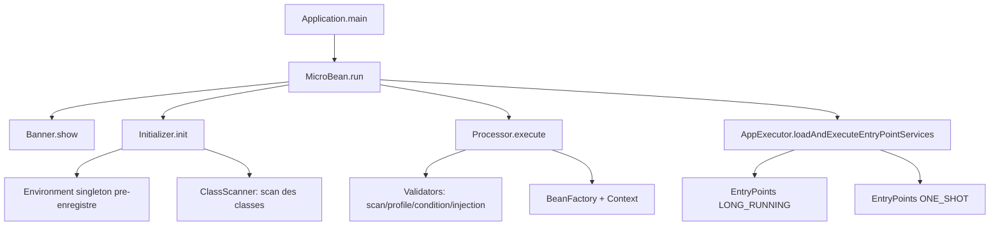
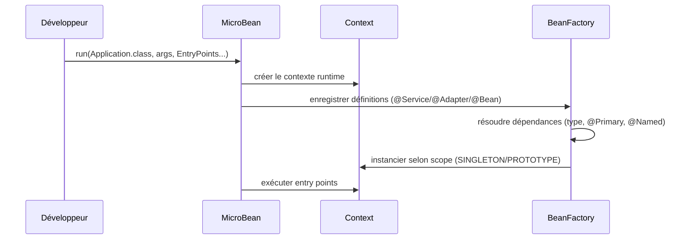

<div align="center">
  <table border="0" cellspacing="0" cellpadding="0">
    <tr>
      <td style="border: none; padding-right: 15px;">
        
      </td>
      <td style="border: none;">
<pre>
888b     d888 d8b                          888888b.
8888b   d8888 Y8P                          888  "88b
88888b.d88888                              888  .88P
888Y88888P888 888  .d8888b 888d888 .d88b.  8888888K.   .d88b.   8888b.  88888b.
888 Y888P 888 888 d88P"    888P"  d88""88b 888  "Y88b d8P  Y8b     "88b 888 "88b
888  Y8P  888 888 888      888    888  888 888    888 88888888 .d888888 888  888
888   "   888 888 Y88b.    888    Y88..88P 888   d88P Y8b.     888  888 888  888
888       888 888  "Y8888P 888     "Y88P"  8888888P"   "Y8888  "Y888888 888  888
</pre>
      </td>
    </tr>
  </table>
</div>


[](https://www.oracle.com/java/technologies/javase/jdk17-archive.html)
[](LICENSE)


> *MicroBean est un mini framework Java d'injection de dépendances et de bootstrap applicatif.
Il propose un modèle simple basé sur des annotations pour déclarer des services, des beans, des profils et des points
d'entrée.*

## 🧭 Sommaire

- [✨ Pourquoi MicroBean](#-pourquoi-microbean)
- [⚖️ Positionnement par rapport à Spring](#-positionnement-par-rapport-à-spring)
- [🧱 Fonctionnement général (Mermaid)](#-fonctionnement-général-mermaid)
- [🚀 Démarrage rapide](#-démarrage-rapide)
- [📖 Journalisation SLF4J](#-journalisation-slf4j)
- [🧪 Exemples utiles](#-exemples-utiles)
- [🧵 Cycle de vie des EntryPoints](#-cycle-de-vie-des-entrypoints)
- [📚 Documentation technique](#-documentation-technique)
- [▶️ Exécuter le projet](#-exécuter-le-projet)
- [📁 Structure du projet](#-structure-du-projet)
- [📄 Licence](#-licence)

## ✨ Pourquoi MicroBean

- ✅ API légère et facile à prendre en main
- ✅ Injection par constructeur et résolution par type, nom (`@Named`) ou priorité (`@Primary`)
- ✅ Gestion des scopes (`SINGLETON`, `PROTOTYPE`)
- ✅ Activation conditionnelle via profils (`@Profile`) et conditions (`@Condition`)
- ✅ Sélection d'implémentations selon l'OS avec `@Adapter(os = ...)`
- ✅ Démarrage piloté par points d'entrée (`@EntryPointService`)
- ✅ Contexte runtime injectable via `Environment` (arguments + profil actif)
- ✅ Logs du framework via `SLF4J` (backend laissé au choix de l'application)

## ⚖️ Positionnement par rapport à Spring

MicroBean **n'a pas vocation à remplacer Spring**.

Spring reste une référence incontournable pour les écosystèmes riches (web, data, sécurité, cloud, observabilité, etc.).
MicroBean cible plutôt les cas où un projet veut surtout un **conteneur IoC léger**, avec une configuration minimale et
une courbe d'apprentissage rapide.

En pratique, MicroBean est pertinent quand vous cherchez :

- un bootstrap simple d'applications console/services internes,
- un framework avec peu de magie et une base technique réduite,
- une injection de dépendances efficace sans embarquer toute une infrastructure.

## 🧱 Fonctionnement général (Mermaid)

### Vue d'ensemble du démarrage



### Cycle IoC simplifié



## 🚀 Démarrage rapide

### Prérequis

- Java 17+
- Maven 3.9+

### 1) Classe application

```java
package com.example.app;

import com.jasonpercus.microbean.MicroBean;
import com.jasonpercus.microbean.api.MicroBeanApplication;

@MicroBeanApplication(scanPackages = {"com.example.app"})
public class Application {

    public static void main(String[] args) {
        MicroBean.setEnabledDebugMicroBean(true);
        MicroBean.run(Application.class, args, MainService.class);
    }
}
```

### 2) Point d'entrée

```java
package com.example.app;

import com.jasonpercus.microbean.api.ApplicationEntryPoint;
import com.jasonpercus.microbean.api.EntryPointService;
import com.jasonpercus.microbean.api.LifecycleEntryPoint;

@EntryPointService(lifecycle = LifecycleEntryPoint.ONE_SHOT)
public class MainService implements ApplicationEntryPoint {

    private final GreetingService greetingService;

    public MainService(GreetingService greetingService) {
        this.greetingService = greetingService;
    }

    @Override
    public void main(String[] args) throws Exception {
        System.out.println(greetingService.greet("MicroBean"));
    }
}
```

### 3) Service injecte

```java
package com.example.app;

import com.jasonpercus.microbean.api.Service;

@Service
public class GreetingService {

    public String greet(String name) {
        return "Hello " + name;
    }
}
```

## 📖 Journalisation SLF4J

MicroBean publie ses logs via l'API `SLF4J` (`org.slf4j:slf4j-api`).
Le framework **n'impose pas** de backend: c'est l'application consommatrice qui choisit son binder (`Logback`, `Log4j2`, etc.).

Si aucun backend SLF4J n'est présent, les logs du framework peuvent être silencieux (NOP logger), 
mais apparaître néanmmoins dans la console.

### Exemple 1: binder Logback

```xml
<dependency>
    <groupId>ch.qos.logback</groupId>
    <artifactId>logback-classic</artifactId>
    <version>1.5.18</version>
</dependency>
```

### Exemple 2: binder Log4j2

```xml
<dependency>
    <groupId>org.apache.logging.log4j</groupId>
    <artifactId>log4j-slf4j2-impl</artifactId>
    <version>2.25.4</version>
</dependency>

<dependency>
    <groupId>org.apache.logging.log4j</groupId>
    <artifactId>log4j-core</artifactId>
    <version>2.25.4</version>
</dependency>
```

> Conseil: n'ajoutez qu'un seul binder SLF4J dans votre application pour éviter les conflits.

## 🧪 Exemples utiles

### Injection par type, `@Primary` et `@Named`

```java
package com.example.payment;

public interface PaymentGateway {

    String pay();
}
```

```java
package com.example.payment;

import com.jasonpercus.microbean.api.Primary;
import com.jasonpercus.microbean.api.Service;

@Service(name = "stripe")
@Primary
public class StripeGateway implements PaymentGateway {

    @Override
    public String pay() {
        return "paid with stripe";
    }
}
```

```java
package com.example.payment;

import com.jasonpercus.microbean.api.Service;

@Service(name = "paypal")
public class PaypalGateway implements PaymentGateway {

    @Override
    public String pay() {
        return "paid with paypal";
    }
}
```

```java
package com.example.payment;

import com.jasonpercus.microbean.api.Named;
import com.jasonpercus.microbean.api.Service;

@Service
public class CheckoutService {

    private final PaymentGateway defaultGateway;
    private final PaymentGateway paypalGateway;

    public CheckoutService(PaymentGateway defaultGateway,
                           @Named("paypal") PaymentGateway paypalGateway) {
        this.defaultGateway = defaultGateway;
        this.paypalGateway = paypalGateway;
    }

    public String demo() {
        return defaultGateway.pay() + " | " + paypalGateway.pay();
    }
}
```

### `@Configuration` et `@Bean`

```java
package com.example.config;

import com.jasonpercus.microbean.api.Bean;
import com.jasonpercus.microbean.api.Configuration;
import com.jasonpercus.microbean.api.Scope;

import java.time.Clock;
import java.util.UUID;

@Configuration
public class AppConfig {

    @Bean
    public Clock appClock() {
        return Clock.systemUTC();
    }

    @Bean(name = "requestId", scope = Scope.PROTOTYPE)
    public String requestId() {
        return UUID.randomUUID().toString();
    }
}
```

### Profiles (`@Profile`)

```java
package com.example.profile;

import com.jasonpercus.microbean.api.Profile;
import com.jasonpercus.microbean.api.Service;

@Service
@Profile("debug")
public class DebugLogger {
    
    public void log(String msg) {
        System.out.println("[DEBUG] " + msg);
    }
}
```

Activez un profil au lancement :

```powershell
mvn "-Dapp.profile=debug" test
```

### Conditions (`@Condition`)

```java
package com.example.condition;

import com.jasonpercus.microbean.api.ConditionEvaluator;

public class FeatureFlagEvaluator implements ConditionEvaluator {

    @Override
    public boolean validate(String[] args) {
        return Boolean.parseBoolean(System.getProperty("feature.x", "false"));
    }
}
```

```java
package com.example.condition;

import com.jasonpercus.microbean.api.Condition;
import com.jasonpercus.microbean.api.Service;

@Service
@Condition(value = FeatureFlagEvaluator.class)
public class FeatureXService {

}
```

### Adapters OS (`@Adapter` + `OS`)

```java
package com.example.file;

public interface FileGateway {

    String separator();
}
```

### Contexte runtime (`Environment` + `Arguments`)

```java
package com.example.runtime;

import com.jasonpercus.microbean.api.Environment;
import com.jasonpercus.microbean.api.Service;

@Service
public class RuntimeInfoService {

    private final Environment environment;

    public RuntimeInfoService(Environment environment) {
        this.environment = environment;
    }

    public void printInfo() {
        System.out.println("Profile actif: " + environment.getProfile());
        System.out.println("Args: " + environment.getArguments());
    }
}
```

```java
package com.example.file;

import com.jasonpercus.microbean.api.Adapter;
import com.jasonpercus.microbean.api.OS;

@Adapter(os = OS.WINDOWS)
public class WindowsFileGateway implements FileGateway {

    @Override
    public String separator() {
        return "\\\\";
    }
}
```

```java
package com.example.file;

import com.jasonpercus.microbean.api.Adapter;
import com.jasonpercus.microbean.api.OS;

@Adapter(os = OS.LINUX)
public class LinuxFileGateway implements FileGateway {

    @Override
    public String separator() {
        return "/";
    }
}
```

## 🧵 Cycle de vie des EntryPoints

- `LifecycleEntryPoint.LONG_RUNNING` : exécuté dans un thread dédié
- `LifecycleEntryPoint.ONE_SHOT` : exécuté sur le thread courant

Le moteur d'exécution priorise les entry points `LONG_RUNNING` avant `ONE_SHOT`.
Cette stratégie garantit que les threads long-running sont bien démarrés avant qu'un one-shot potentiellement bloquant
ne termine l'exécution courante.

## 📚 Documentation technique

### Coeur

- [`src/documentation/com/jasonpercus/microbean/MicroBean.md`](src/documentation/com/jasonpercus/microbean/MicroBean.md)

### API (annotations et contrats)

- [`src/documentation/com/jasonpercus/microbean/api/Adapter.md`](src/documentation/com/jasonpercus/microbean/api/Adapter.md)
- [`src/documentation/com/jasonpercus/microbean/api/ApplicationEntryPoint.md`](src/documentation/com/jasonpercus/microbean/api/ApplicationEntryPoint.md)
- [`src/documentation/com/jasonpercus/microbean/api/Bean.md`](src/documentation/com/jasonpercus/microbean/api/Bean.md)
- [`src/documentation/com/jasonpercus/microbean/api/Condition.md`](src/documentation/com/jasonpercus/microbean/api/Condition.md)
- [`src/documentation/com/jasonpercus/microbean/api/ConditionEvaluator.md`](src/documentation/com/jasonpercus/microbean/api/ConditionEvaluator.md)
- [`src/documentation/com/jasonpercus/microbean/api/Configuration.md`](src/documentation/com/jasonpercus/microbean/api/Configuration.md)
- [`src/documentation/com/jasonpercus/microbean/api/EntryPointService.md`](src/documentation/com/jasonpercus/microbean/api/EntryPointService.md)
- [`src/documentation/com/jasonpercus/microbean/api/Environment.md`](src/documentation/com/jasonpercus/microbean/api/Environment.md)
- [`src/documentation/com/jasonpercus/microbean/api/LifecycleEntryPoint.md`](src/documentation/com/jasonpercus/microbean/api/LifecycleEntryPoint.md)
- [`src/documentation/com/jasonpercus/microbean/api/MicroBeanApplication.md`](src/documentation/com/jasonpercus/microbean/api/MicroBeanApplication.md)
- [`src/documentation/com/jasonpercus/microbean/api/Named.md`](src/documentation/com/jasonpercus/microbean/api/Named.md)
- [`src/documentation/com/jasonpercus/microbean/api/OS.md`](src/documentation/com/jasonpercus/microbean/api/OS.md)
- [`src/documentation/com/jasonpercus/microbean/api/PostConstruct.md`](src/documentation/com/jasonpercus/microbean/api/PostConstruct.md)
- [`src/documentation/com/jasonpercus/microbean/api/Primary.md`](src/documentation/com/jasonpercus/microbean/api/Primary.md)
- [`src/documentation/com/jasonpercus/microbean/api/Profile.md`](src/documentation/com/jasonpercus/microbean/api/Profile.md)
- [`src/documentation/com/jasonpercus/microbean/api/Scope.md`](src/documentation/com/jasonpercus/microbean/api/Scope.md)
- [`src/documentation/com/jasonpercus/microbean/api/Service.md`](src/documentation/com/jasonpercus/microbean/api/Service.md)

### Infrastructure

- Factory
  - [`src/documentation/com/jasonpercus/microbean/infrastructure/factory/BeanDefinition.md`](src/documentation/com/jasonpercus/microbean/infrastructure/factory/BeanDefinition.md)
  - [`src/documentation/com/jasonpercus/microbean/infrastructure/factory/BeanFactory.md`](src/documentation/com/jasonpercus/microbean/infrastructure/factory/BeanFactory.md)
  - [`src/documentation/com/jasonpercus/microbean/infrastructure/factory/Context.md`](src/documentation/com/jasonpercus/microbean/infrastructure/factory/Context.md)
- Run
  - [`src/documentation/com/jasonpercus/microbean/infrastructure/run/AppExecutor.md`](src/documentation/com/jasonpercus/microbean/infrastructure/run/AppExecutor.md)
  - [`src/documentation/com/jasonpercus/microbean/infrastructure/run/Banner.md`](src/documentation/com/jasonpercus/microbean/infrastructure/run/Banner.md)
  - [`src/documentation/com/jasonpercus/microbean/infrastructure/run/Initializer.md`](src/documentation/com/jasonpercus/microbean/infrastructure/run/Initializer.md)
  - [`src/documentation/com/jasonpercus/microbean/infrastructure/run/Processor.md`](src/documentation/com/jasonpercus/microbean/infrastructure/run/Processor.md)
- Scanner
  - [`src/documentation/com/jasonpercus/microbean/infrastructure/scanner/ClassScanner.md`](src/documentation/com/jasonpercus/microbean/infrastructure/scanner/ClassScanner.md)
- Validator
  - [`src/documentation/com/jasonpercus/microbean/infrastructure/validator/ConditionValidator.md`](src/documentation/com/jasonpercus/microbean/infrastructure/validator/ConditionValidator.md)
  - [`src/documentation/com/jasonpercus/microbean/infrastructure/validator/InjectionResolutionValidator.md`](src/documentation/com/jasonpercus/microbean/infrastructure/validator/InjectionResolutionValidator.md)
  - [`src/documentation/com/jasonpercus/microbean/infrastructure/validator/ProfileValidator.md`](src/documentation/com/jasonpercus/microbean/infrastructure/validator/ProfileValidator.md)
  - [`src/documentation/com/jasonpercus/microbean/infrastructure/validator/ScanningValidator.md`](src/documentation/com/jasonpercus/microbean/infrastructure/validator/ScanningValidator.md)
  - [`src/documentation/com/jasonpercus/microbean/infrastructure/validator/Validator.md`](src/documentation/com/jasonpercus/microbean/infrastructure/validator/Validator.md)

## ▶️ Exécuter le projet

```powershell
mvn clean test
```

Pour lancer une classe `main` concrète (selon votre configuration), vous pouvez utiliser un plugin Maven adapté à votre
projet.

## 📁 Structure du projet

- Code principal : `src/main/java`
- Tests unitaires : `src/test/java`
- Ressources : `src/main/resources`
- Documentation : `src/documentation`

## 📚 Ressources

- [ArchUnit Documentation](https://www.archunit.org/)
- [Java 17 Features](https://www.oracle.com/java/technologies/javase/jdk17-archive.html)

## 💬 Support

Pour des problèmes ou des questions :
- Ouvrez une issue sur [GitHub](https://github.com/jasonpercus/MicroBean)
- Consultez la documentation du [framework MicroBean](https://github.com/jasonpercus/MicroBean)

## 🤝 Contribution

Les contributions sont bienvenues ! Veuillez :

1. Fork le projet
2. Créer une branche pour votre fonctionnalité (`git checkout -b feature/amazing-feature`)
3. Committer vos changements (`git commit -m 'Add some amazing feature'`)
4. Pousser vers la branche (`git push origin feature/amazing-feature`)
5. Ouvrir une Pull Request

## 📄 Licence

Ce projet est licencié sous la [Licence MIT](LICENSE).

---

**Créé avec ❤️ par [Jason Percus](https://github.com/jasonpercus)**
