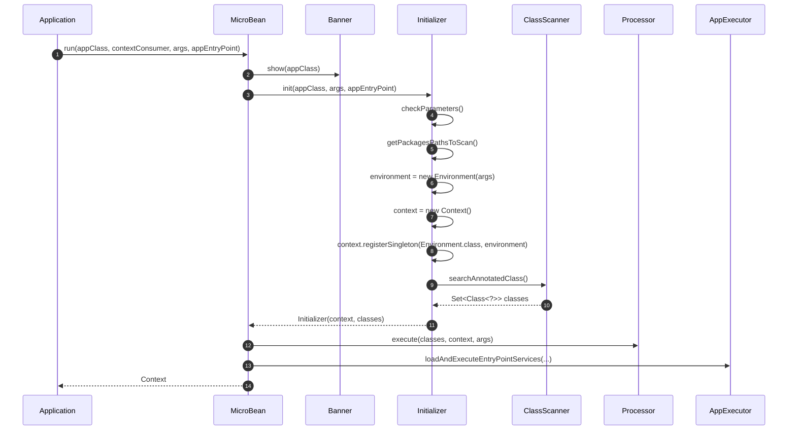
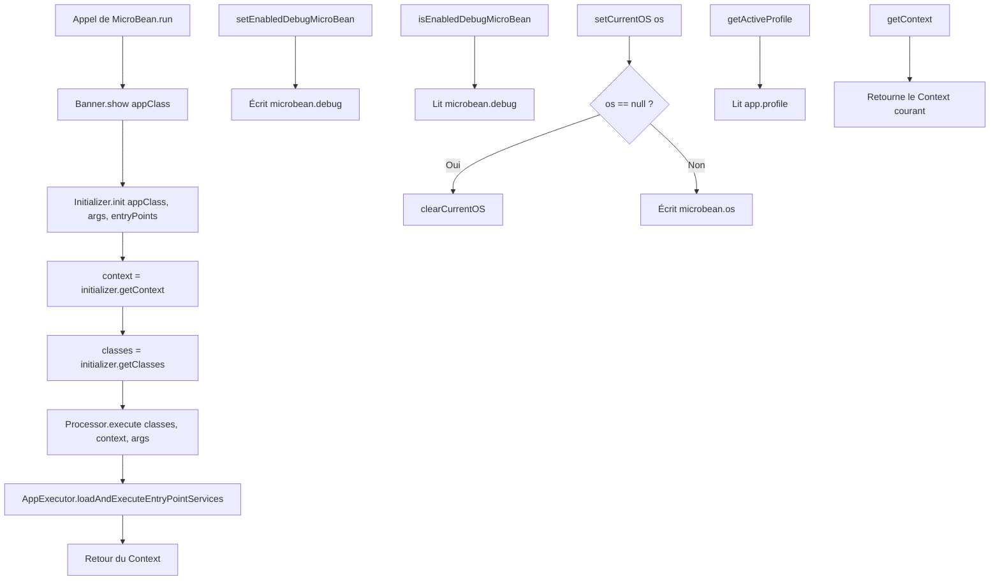

# ⚙️ MicroBean (com.jasonpercus.microbean)

> 📘 Documentation technique orientée maintenance et évolution.

## 1) 🧭 Vue d’ensemble

`MicroBean` est la **façade statique principale** du framework.
Son rôle est de piloter le bootstrap complet d’une application MicroBean, puis d’exposer quelques utilitaires globaux liés au runtime.

Ses responsabilités principales sont les suivantes :

- 🚀 déclencher le démarrage global de l’application ;
- 🖼️ afficher la bannière de démarrage ;
- 🧱 initialiser le contexte via `Initializer` ;
- 🌍 pré-instancier l'`Environment` runtime (arguments + profil) via `Initializer` ;
- 🔎 lancer le traitement des classes détectées via `Processor` ;
- ▶️ charger et exécuter les points d’entrée via `AppExecutor` ;
- 🐞 activer ou désactiver le mode debug ;
- 💻 forcer l’OS courant utilisé par le framework ;
- 🏷️ exposer le profil actif courant.

En pratique, `MicroBean` répond au besoin suivant : **offrir un point d’entrée unique, simple et cohérent pour démarrer le framework et accéder à quelques réglages globaux de runtime**.

Fichier source : `src/main/java/com/jasonpercus/microbean/MicroBean.java`

---

## 2) 🔗 Positionnement dans le flux applicatif

`MicroBean` est la classe la plus haute dans la séquence de démarrage visible depuis le code applicatif.
C’est elle que l’application appelle directement via `run(...)`.

Le flux réel observé dans le code est :

1. `Banner.show(appClass)`
2. `Initializer.init(appClass, args, appEntryPoint)`
3. `Initializer` crée `Environment(args)` et l'enregistre en singleton dans `Context`
4. `initializer.getContext()`
5. `Processor.execute(initializer.getClasses(), context, args)`
6. `AppExecutor.loadAndExecuteEntryPointServices(contextConsumer, args, appEntryPoint, context)`
7. retour du `Context`

Donc `MicroBean` joue le rôle d’**orchestrateur central** :

- il ne réalise pas lui-même le scan, l’injection ou l’exécution métier ;
- il coordonne les composants d’infrastructure qui réalisent ces tâches ;
- il garantit un enchaînement stable entre les différentes étapes du bootstrap.

Références principales :

- `src/main/java/com/jasonpercus/microbean/infrastructure/run/Banner.java`
- `src/main/java/com/jasonpercus/microbean/infrastructure/run/Initializer.java`
- `src/main/java/com/jasonpercus/microbean/infrastructure/run/Processor.java`
- `src/main/java/com/jasonpercus/microbean/infrastructure/run/AppExecutor.java`

### 🧵 Diagramme de séquence (vue d’ensemble)

---

## 3) 💡 Idée fonctionnelle : à quoi répond cette classe

`MicroBean` répond à deux besoins fonctionnels majeurs.

### 3.1 Démarrer le framework avec une API simple

Au lieu d’exiger du code applicatif qu’il instancie et appelle lui-même chaque composant du bootstrap (`Banner`, `Initializer`, `Processor`, `AppExecutor`), `MicroBean` encapsule toute cette séquence dans une méthode `run(...)`.

### 3.2 Centraliser les réglages runtime globaux

La classe porte également deux réglages de portée globale :

- le mode debug via `PROPERTY_MICROBEAN_DEBUG` ;
- l’override de l’OS via `PROPERTY_MICROBEAN_OS`.

Elle permet aussi de lire le profil actif via `getActiveProfile()`, basé sur la propriété système `app.profile`.

Sans cette classe, le framework serait plus difficile à démarrer, plus verbeux côté utilisateur, et plus fragile quant à la cohérence des étapes de bootstrap.

---

## 4) 🧠 Comportement méthode par méthode

### `public static Context run(Class<?> appClass, String[] args, Class<? extends ApplicationEntryPoint>... appEntryPoint)`

- Surcharge de confort pour démarrer une application **sans** `Consumer<Context>`.
- Délègue directement à la seconde surcharge en passant `null` comme consommateur.
- Son intérêt principal est ergonomique : réduire le code côté application.

### `public static Context run(Class<?> appClass, Consumer<Context> contextConsumer, String[] args, Class<? extends ApplicationEntryPoint>... appEntryPoint)`

C’est la méthode centrale de la classe.

Elle :

- affiche la bannière ;
- initialise le runtime via `Initializer` ;
- rend disponible un `Environment` singleton injectable dans tous les beans ;
- récupère le `Context` produit ;
- lance le traitement des classes détectées ;
- exécute les entry points ;
- retourne le `Context` final.

#### Entrées

- `appClass` : classe principale de l’application ;
- `contextConsumer` : callback optionnel exécuté autour du contexte ;
- `args` : arguments de ligne de commande ;
- `appEntryPoint` : classes d’entrée applicatives.

#### Sortie

- retourne le `Context` initialisé.

#### Remarque importante

Les validations métier ne sont **pas** faites directement dans `MicroBean`, mais indirectement dans `Initializer.init(...)`.
Ainsi, `MicroBean.run(...)` peut lever des exceptions liées à une configuration invalide, sans contenir lui-même la logique de validation.

### `public static void setEnabledDebugMicroBean(boolean enabled)`

- Écrit la propriété système `microbean.debug`.
- Sert à activer ou désactiver le mode debug du framework.
- Effet de bord direct : modification de l’état global de la JVM.

### `public static boolean isEnabledDebugMicroBean()`

- Lit la propriété système `microbean.debug`.
- Retourne `true` uniquement si sa valeur vaut `"true"` sans tenir compte de la casse.
- Toute autre valeur, y compris `null`, produit `false`.

### `public static void setCurrentOS(OS os)`

- Si `os` est non nul : écrit `os.name()` dans `microbean.os`.
- Si `os` est nul : délègue à `clearCurrentOS()`.
- Cette méthode ne détecte pas l’OS ; elle ne fait qu’écrire un override.

### `public static void clearCurrentOS()`

- Supprime explicitement la propriété système `microbean.os`.
- Permet de revenir au mécanisme normal de détection d’OS.

### `public static String getActiveProfile()`

- Retourne simplement la propriété système `app.profile`.
- Si la propriété n’existe pas, retourne `null`.
- Cette méthode n’interprète pas la valeur ; elle se contente de l’exposer.

### `public static Context getContext()`

- Retourne le `Context` actuellement utilisé par le framework.
- En pratique, ce `Context` est celui créé et retourné par `Initializer.init(...)`.
- Permet d’accéder au contexte global à tout moment, même en dehors du flux de bootstrap.
- Attention : ce `Context` est partagé et peut être modifié par d’autres composants ; il doit être utilisé avec précaution.
- Il est recommandé de privilégier l’injection de `Context` dans les beans plutôt que son accès statique via cette méthode.
- Cette méthode est principalement destinée à des cas d’usage spécifiques où l’injection n’est pas possible ou pratique.
- Si le `Context` n’a pas encore été initialisé (par exemple, si `getContext()` est appelé avant `run(...)`), cette méthode lèvera une exception.

### 🌊 Diagramme de flux (orchestration + propriétés système)

---

## 5) 📐 Contrats implicites importants (pour la maintenance)

Plusieurs contrats implicites doivent être conservés.

- ✅ **L’ordre du bootstrap est important** : bannière -> initialisation -> traitement -> exécution.
- ✅ **La surcharge simple de `run(...)` doit rester un simple point de délégation** vers la surcharge complète.
- ✅ **Le `Context` retourné est celui produit par `Initializer`**, pas une nouvelle instance créée localement.
- ✅ **`MicroBean` ne valide pas directement les classes applicatives** : cette responsabilité reste dans `Initializer`.
- ✅ **Les utilitaires `debug`, `OS` et `profil` reposent sur les propriétés système** ; ils modifient donc un état global partagé.
- ✅ **`setCurrentOS(null)` doit rester équivalent à `clearCurrentOS()`**.

Dépendances structurantes de `MicroBean` :

- `Banner` pour l’affichage d’introduction ;
- `Initializer` pour la préparation du runtime ;
- `Processor` pour le traitement IoC/scan/injection ;
- `AppExecutor` pour l’exécution des points d’entrée ;
- `OperatingSystemHelper` de manière indirecte, via la propriété `microbean.os`.

---

## 6) ⚠️ Risques lors des modifications

Si vous modifiez `MicroBean`, vérifier en priorité :

1. **Ordre des appels** : inverser des étapes du bootstrap peut casser le comportement global.
2. **Compatibilité des surcharges `run(...)`** : la version courte doit continuer à produire exactement le même flux que la version complète.
3. **Effets de bord globaux** : `setEnabledDebugMicroBean`, `setCurrentOS` et `clearCurrentOS` modifient des propriétés système partagées.
4. **Propagation des exceptions** : `MicroBean` doit continuer à laisser remonter les erreurs pertinentes du bootstrap.
5. **Contrat de retour** : le `Context` retourné doit rester celui réellement utilisé pendant le traitement et l’exécution.

> 🛡️ Recommandation : toute évolution de `MicroBean` doit être testée à la fois en unitaire (orchestration + propriétés) et en Cucumber (flux réel bout en bout).

---

## 7) 🧪 Tests existants sur `MicroBean`

### 7.1 ✅ Tests unitaires

Fichier : `src/test/java/com/jasonpercus/microbean/MicroBeanTest.java`

Les tests unitaires existants couvrent les points suivants.

#### Orchestration de `run(...)`

- levée d’exception si `run(...)` reçoit une classe non annotée `@MicroBeanApplication` ;
- levée d’exception pour la surcharge avec `Consumer<Context>` dans le même cas ;
- orchestration nominale de `run(...)` sans consumer via Mockito statique sur :
  - `Banner.show(...)`,
  - `Initializer.init(...)`,
  - `Processor.execute(...)`,
  - `AppExecutor.loadAndExecuteEntryPointServices(...)` ;
- orchestration nominale équivalente pour la surcharge avec consumer.

#### Utilitaires runtime

- activation du mode debug ;
- désactivation du mode debug ;
- écriture de l’OS forcé ;
- suppression de l’OS forcé via `setCurrentOS(null)` ;
- suppression de l’OS forcé via `clearCurrentOS()` ;
- lecture du profil actif lorsqu’il est défini ;
- retour `null` quand le profil n’est pas défini.

#### Isolation des tests

- restauration systématique des propriétés système après chaque test.

Ce que ces tests garantissent :

- `MicroBean` appelle bien les composants d’infrastructure attendus ;
- les surcharges de `run(...)` respectent leur contrat ;
- les méthodes utilitaires liées aux propriétés système ont le bon comportement.

### 7.2 🥒 Tests Cucumber (intégration comportementale)

Fichiers :

- `src/test/resources/com/jasonpercus/microbean/cucumber/microbean.feature`
- `src/test/java/com/jasonpercus/microbean/cucumber/steps/MicroBeanStepdefinitions.java`

Les scénarios les plus directement liés à `MicroBean` sont les suivants.

#### Scénarios d’erreur visibles via `MicroBean.run(...)`

1. absence de `@MicroBeanApplication` ;
2. aucun entry point défini ;
3. classe principale également annotée `@EntryPointService` ;
4. entry point non annoté `@EntryPointService`.

Même si la logique d’erreur est portée par `Initializer`, ces scénarios valident que **l’appel public via `MicroBean`** propage bien ces erreurs dans un contexte réel.

#### Scénario nominal global

Le scénario nominal valide notamment que :

- le framework peut être exécuté via `MicroBean.run(...)` ;
- la bannière s’affiche ;
- le profil actif est bien lu et affiché ;
- le `Consumer<Context>` est bien exécuté ;
- les classes sont détectées, traitées, injectées puis exécutées jusqu’aux entry points.

Ce que ces scénarios apportent en plus des unitaires :

- 🧪 validation **bout en bout** du rôle d’orchestrateur de `MicroBean` ;
- 🧾 vérification des sorties utilisateur visibles (bannière, profil, comportement global) ;
- 🔗 garantie que `MicroBean` reste correctement connecté à l’ensemble du pipeline runtime.

---

## 8) 🧰 Ce qu’un mainteneur doit retenir

- `MicroBean` est la **façade publique principale** du framework.
- Son code est court, mais il est central car il relie tous les composants du bootstrap.
- Toute modification sur `run(...)` peut casser le démarrage complet du framework.
- Les méthodes liées aux propriétés système ont des effets de bord globaux ; elles doivent rester simples, prévisibles et bien testées.
- Les tests unitaires garantissent l’orchestration locale ; les scénarios Cucumber garantissent la cohérence du comportement réel.

En cas de refactor, il est recommandé de commencer par verrouiller la séquence d’appels de `run(...)`, puis de rejouer les tests unitaires et les scénarios Cucumber les plus représentatifs.

---

## 9) 🗺️ Légende visuelle rapide

- ✅ Validation / précondition
- 🧱 Initialisation / contexte
- 🔎 Analyse / traitement
- ⚠️ Point de vigilance
- 🧪 Couverture de tests
- 🛡️ Recommandation de fiabilité
