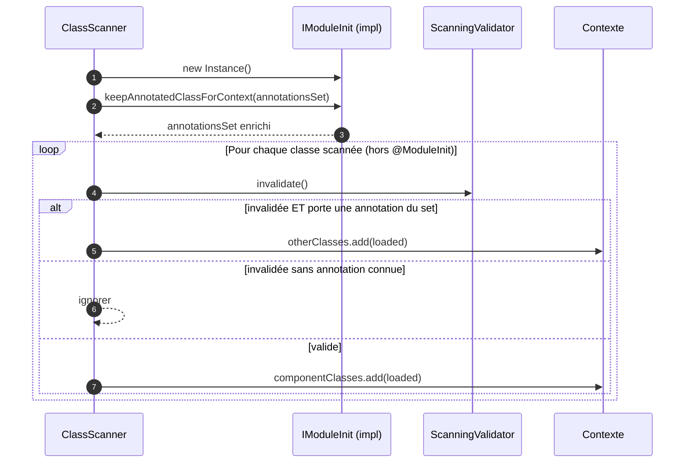

# 🧩 IModuleInit (infrastructure.api)

> 📘 Documentation technique orientée maintenance et évolution.

## 1) 🧭 Vue d'ensemble

`IModuleInit` est le **contrat fonctionnel** des modules d'initialisation MicroBean.

Il est implémenté par les classes annotées [`@ModuleInit`](./ModuleInit.md) pour déclarer quelles annotations supplémentaires le scanner doit prendre en compte lors du filtrage des classes invalidées.

Responsabilités principales :

- 📣 déclarer des annotations personnalisées à injecter dans le pipeline de scan ;
- 🔄 permettre l'extensibilité du framework sans modification du code core ;
- 🛡️ offrir une implémentation par défaut no-op pour les modules ne souhaitant pas étendre ce comportement.

Fichier source : `src/main/java/com/jasonpercus/microbean/infrastructure/api/IModuleInit.java`

---

## 2) 🔗 Positionnement dans le flux MicroBean

`IModuleInit` intervient dans `ClassScanner.getOthersAnnotationsToKeep(...)` :

1. Le scanner collecte toutes les classes annotées `@ModuleInit`.
2. Pour chaque classe, il vérifie si elle implémente `IModuleInit`.
3. Si oui, il instancie la classe (constructeur sans argument) et appelle `keepAnnotatedClassForContext(set)`.
4. Les annotations ajoutées au `set` sont ensuite utilisées dans `analyseAndPushAnnotatedClass(...)` pour décider si une classe invalidée doit être placée dans `otherClasses`.

### 🧵 Diagramme de séquence



---

## 3) 💡 Idée fonctionnelle

`IModuleInit` répond au besoin d'**extensibilité dynamique** du scanner MicroBean.

Sans ce contrat :
- les modules tiers ne peuvent pas exposer leurs propres annotations de composants ;
- le scanner ne distingue pas les classes annotées avec des annotations non standard ;
- les classes non retenues (invalidées) seraient toutes perdues, même celles utiles aux modules.

Avec `IModuleInit` :
- chaque module peut déclarer ses annotations dans le pipeline du scanner ;
- les classes portant ces annotations et invalidées (ex : mauvais profil) sont transmises au contexte dans `otherClasses` pour que le module puisse les traiter ;
- le framework reste ouvert à l'extension sans modification du code existant.

---

## 4) ⚙️ API

### `default void keepAnnotatedClassForContext(Set<Class<? extends Annotation>> clazz)`

| Propriété                 | Détail                                                                                    |
|---------------------------|-------------------------------------------------------------------------------------------|
| Visibilité                | `public` (interface)                                                                      |
| Implémentation par défaut | méthode vide (no-op)                                                                      |
| Paramètre `clazz`         | ensemble mutable fourni par le scanner, jamais `null`                                     |
| Contrat attendu           | ajouter dans `clazz` les annotations dont les classes doivent être transmises au contexte |
| Retour                    | `void`                                                                                    |

---

## 5) 💻 Exemples d'utilisation

### Cas minimal (no-op)

```java
@ModuleInit
public class MinimalModule implements IModuleInit {
    // keepAnnotatedClassForContext non surchargé : comportement no-op par défaut
}
```

### Cas complet : exposition d'annotations personnalisées

```java
@ModuleInit
public class SecurityModuleInit implements IModuleInit {

    @Override
    public void keepAnnotatedClassForContext(Set<Class<? extends Annotation>> annotations) {
        annotations.add(SecurityFilter.class);
        annotations.add(AccessPolicy.class);
    }
}
```

Résultat : les classes annotées `@SecurityFilter` ou `@AccessPolicy` qui seraient normalement exclues par le `ScanningValidator` (mauvais profil, condition non remplie…) sont transmises dans `otherClasses` du contexte pour être traitées par le module.

### Usage dans un module serveur (exemple MicroBean-server)

```java
@ModuleInit
public class ServerModuleInit implements IModuleInit {

    @Override
    public void keepAnnotatedClassForContext(Set<Class<? extends Annotation>> annotations) {
        annotations.add(ServerBean.class);
    }
}
```

---

## 6) 📐 Contrats implicites

| Règle                                                                          | Détail                                                                   |
|--------------------------------------------------------------------------------|--------------------------------------------------------------------------|
| Constructeur sans argument obligatoire                                         | utilisé par réflexion dans `ClassScanner`                                |
| Exception dans le constructeur                                                 | l'erreur est journalisée, le module est ignoré                           |
| L'ensemble `clazz` est toujours non-null                                       | le scanner l'initialise avant d'appeler la méthode                       |
| Aucune obligation d'ajouter quoi que ce soit                                   | la méthode par défaut est valide                                         |
| Les annotations ajoutées doivent être `@Retention(RUNTIME)` et `@Target(TYPE)` | sinon elles ne seront jamais portées par les classes concrètes détectées |

---

## 7) ⚠️ Risques lors des modifications

1. **Modifier la signature de `keepAnnotatedClassForContext`** : rupture de compatibilité binaire pour tous les modules existants.
2. **Retirer l'implémentation par défaut (`default`)** : les implémentations n'ayant pas surredéfini la méthode ne compileront plus.
3. **Modifier la logique dans `ClassScanner.getOthersAnnotationsToKeep`** : le contrat de ce qui est transmis à `otherClasses` change pour tous les modules.

> 🛡️ Recommandation : toute évolution de ce contrat doit être accompagnée d'une mise à jour de [`@ModuleInit`](./ModuleInit.md) et d'une validation dans `ClassScannerTest`.

---

## 8) 🧪 Tests existants

Fichier : `src/test/java/com/jasonpercus/microbean/infrastructure/scanner/ClassScannerTest.java`

Cas couverts via les tests de `getOthersAnnotationsToKeep` :

| Test                                         | Comportement vérifié                        |
|----------------------------------------------|---------------------------------------------|
| Null en entrée                               | renvoie un ensemble vide                    |
| `ValidModuleInit` (implémente IModuleInit)   | l'annotation est collectée                  |
| `ModuleInitWithoutIModuleInit`               | ignorer silencieusement                     |
| `FailingModuleInit` (exception constructeur) | absorber l'erreur sans propagation          |
| `InvalidatedServiceWithCustomAnnotation`     | la classe invalidée est dans `otherClasses` |

---

## 9) 🗺️ Légende visuelle rapide

- 🧩 Contrat d'interface
- 🔧 Configuration de module
- 🔄 Extensibilité / plugin
- ⚠️ Point de vigilance
- 🛡️ Recommandation de fiabilité
- 🧪 Couverture de tests
