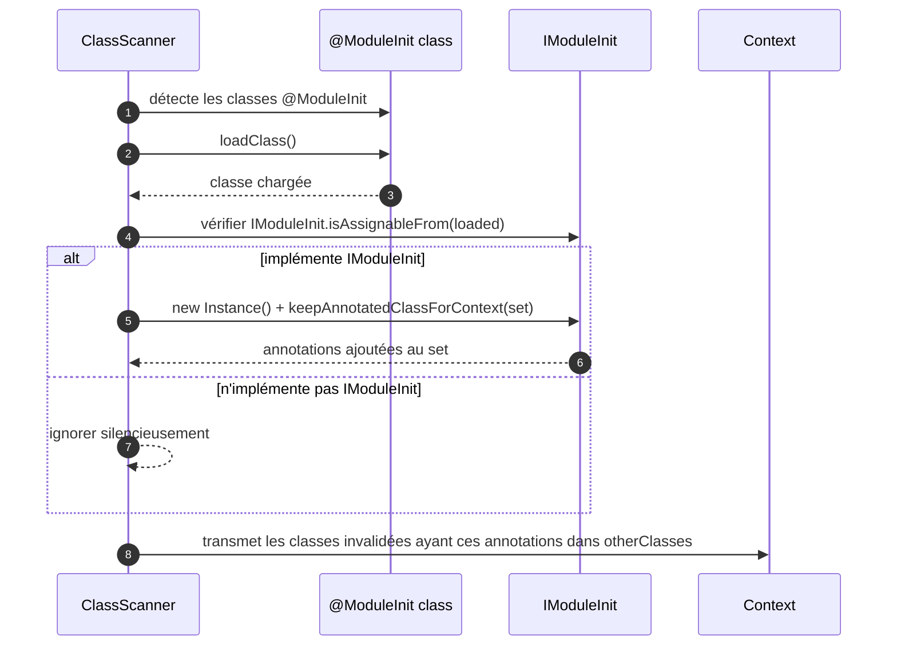

# 🔧 @ModuleInit (infrastructure.api)

> 📘 Documentation technique orientée maintenance et évolution.

## 1) 🧭 Vue d'ensemble

`@ModuleInit` est une annotation de marquage qui identifie une **classe d'initialisation de module** dans MicroBean.

Elle permet aux modules (internes ou tiers) de s'enregistrer auprès du scanner de classes au démarrage et de **configurer dynamiquement le contexte d'injection** avant le traitement des composants applicatifs.

Responsabilités principales :

- 🎯 identifier les classes participant à l'initialisation du framework ;
- 🏷️ déclarer des annotations supplémentaires à transmettre au contexte via [`IModuleInit`](./IModuleInit.md) ;
- ⏩ garantir que ces classes sont traitées **en priorité** sur les autres composants lors du scan.

Fichier source : `src/main/java/com/jasonpercus/microbean/infrastructure/api/ModuleInit.java`

---

## 2) 🔗 Positionnement dans le flux MicroBean

`@ModuleInit` est utilisée pendant la phase de scan des packages applicatifs :

1. `ClassScanner.getAnnotationClassToScan()` collecte toutes les annotations détectées dans les packages `api` et `infrastructure.api`.
2. Le comparateur de scan place les classes portant une annotation meta-annotée `@ModuleInit` **en tête**.
3. `filterScannedClass(...)` isole les classes annotées `@ModuleInit` et appelle `getOthersAnnotationsToKeep(...)`.
4. Pour chaque classe implémentant `IModuleInit`, la méthode `keepAnnotatedClassForContext(...)` est invoquée.
5. L'ensemble des annotations résultantes guide le traitement des classes invalidées dans `analyseAndPushAnnotatedClass(...)`.

### 🧵 Diagramme de séquence



---

## 3) 💡 Idée fonctionnelle

`@ModuleInit` répond au besoin suivant : **permettre à un module MicroBean d'étendre le comportement du scanner sans modifier le framework lui-même**.

Sans ce mécanisme :
- les modules tiers ne peuvent pas déclarer leurs propres annotations de composants ;
- le scanner ne saurait pas quelles classes non-standard doivent être transmises au contexte ;
- l'extensibilité du framework serait réduite.

Avec `@ModuleInit` :
- un module déclare une classe concrète annotée `@ModuleInit` + implémentant `IModuleInit` ;
- il expose ses annotations personnalisées via `keepAnnotatedClassForContext(...)` ;
- le scanner les prend en compte dynamiquement.

---

## 4) 📐 Comportement et règles d'utilisation

| Règle                                       | Détail                                                                                  |
|---------------------------------------------|-----------------------------------------------------------------------------------------|
| La classe doit être concrète                | interfaces et classes abstraites sont exclues par `checkingClass(...)`                  |
| Constructeur public sans argument requis    | l'instanciation est faite par réflexion                                                 |
| Implémentation de `IModuleInit` optionnelle | si absente, la classe est ignorée silencieusement                                       |
| Exception dans le constructeur              | journalisée via `LogHelper.error(...)`, module ignoré                                   |
| Priorité de traitement                      | le comparateur garantit que `@ModuleInit` est traité avant les autres annotations       |
| Non injectable dans le conteneur            | `@ModuleInit` n'est pas un composant ; la classe n'est pas ajoutée à `componentClasses` |

---

## 5) 💻 Exemple d'utilisation

```java
import java.lang.annotation.Annotation;
import java.util.Set;
import com.jasonpercus.microbean.infrastructure.api.IModuleInit;
import com.jasonpercus.microbean.infrastructure.api.ModuleInit;

@ModuleInit
public class SecurityModuleInit implements IModuleInit {

    @Override
    public void keepAnnotatedClassForContext(Set<Class<? extends Annotation>> annotations) {
        annotations.add(SecurityFilter.class);
        annotations.add(AccessPolicy.class);
    }
}
```

Résultat : toutes les classes portant `@SecurityFilter` ou `@AccessPolicy` qui seraient invalidées par le `ScanningValidator` seront transmises dans `otherClasses` du contexte.

---

## 6) ⚠️ Risques lors des modifications

Si vous modifiez l'annotation ou son mécanisme associé dans `ClassScanner` :

1. **Changer la priorité du comparateur** : si `@ModuleInit` n'est plus traité en premier, les annotations déclarées par les modules ne seront pas connues au moment du filtrage des autres composants.
2. **Supprimer le `annotatedClassesMap.remove(ModuleInit...)`** : les classes `@ModuleInit` pourraient être ajoutées à `componentClasses` à tort.
3. **Changer la signature de `keepAnnotatedClassForContext`** : cela casse la compatibilité binaire de tous les modules existants.

> 🛡️ Recommandation : toute modification doit être validée via `ClassScannerTest` (cas `getOthersAnnotationsToKeep`) et les fixtures dédiées.

---

## 7) 🧪 Tests existants

Fichier : `src/test/java/com/jasonpercus/microbean/infrastructure/scanner/ClassScannerTest.java`

Cas couverts pour `getOthersAnnotationsToKeep` :

| Test                                                                                                 | Scénario                                                  |
|------------------------------------------------------------------------------------------------------|-----------------------------------------------------------|
| `doit_retourner_un_ensemble_vide_quand_moduleInitClassInfo_est_null`                                 | Appel avec `null` → ensemble vide                         |
| `doit_collecter_les_annotations_via_un_imoduleinit_valide`                                           | `ValidModuleInit` expose `@CustomComponentAnnotation`     |
| `doit_ignorer_silencieusement_une_classe_moduleinit_sans_imoduleinit`                                | `ModuleInitWithoutIModuleInit` ignoré                     |
| `doit_absorber_l_exception_de_constructeur_d_un_imoduleinit_defaillant`                              | `FailingModuleInit` absorbé sans exception                |
| `doit_placer_dans_otherClasses_une_classe_invalidee_portant_une_annotation_declaree_par_imoduleinit` | `InvalidatedServiceWithCustomAnnotation` → `otherClasses` |

Fixtures associées : `src/test/java/com/jasonpercus/microbean/infrastructure/scanner/fixtures/moduleinit/`

---

## 8) 🗺️ Légende visuelle rapide

- 🔧 Annotation de configuration / initialisation
- ⏩ Priorité de traitement
- ⚠️ Point de vigilance
- 🛡️ Recommandation de fiabilité
- 🧪 Couverture de tests
