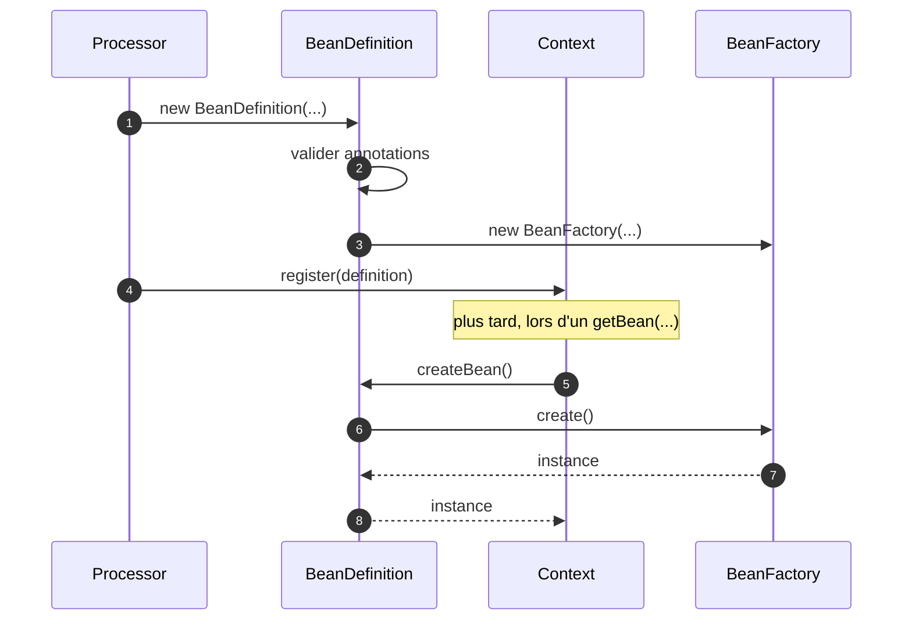
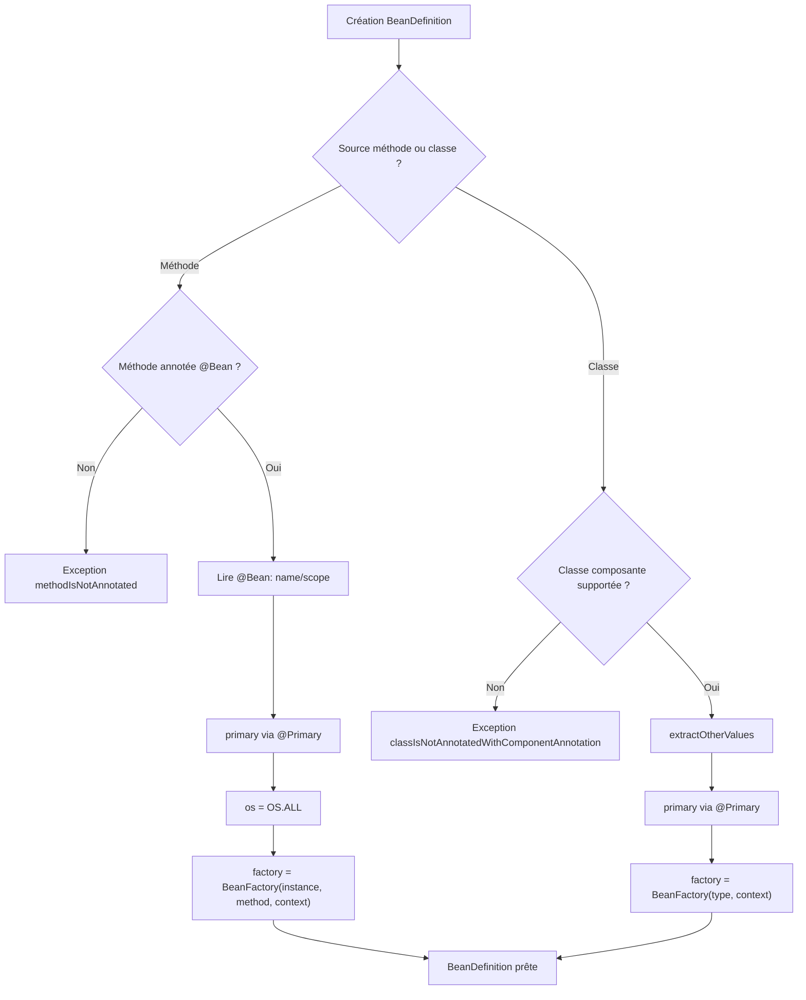

# 🧱 BeanDefinition (infrastructure.factory)

> 📘 Documentation technique orientée maintenance et évolution.

## 1) 🧭 Vue d'ensemble

`BeanDefinition` représente la **description technique d'un bean** dans le conteneur MicroBean.
Elle ne stocke pas l'instance elle-même ; elle stocke les informations nécessaires pour la créer et la résoudre correctement.

Responsabilités principales :

- ✅ porter le type principal exposé au `Context` ;
- 🏷️ porter les métadonnées (`name`, `scope`, `primary`, `os`) ;
- ⚙️ encapsuler la stratégie de création via `BeanFactory` ;
- 🛡️ valider les entrées (méthode non `@Bean`, classe non composante) ;
- 🔎 dériver les valeurs selon la source (`@Bean`, `@Service`, `@Adapter`, `@EntryPointService`).

Fichier source : `src/main/java/com/jasonpercus/microbean/infrastructure/factory/BeanDefinition.java`

---

## 2) 🔗 Positionnement dans le flux MicroBean

`BeanDefinition` est construite principalement dans `Processor` puis enregistrée dans `Context`.

Flux simplifié :

1. `Processor` détecte une méthode `@Bean` ou une classe composante.
2. `Processor` crée un `new BeanDefinition<>(...)`.
3. `Context.register(definition)` indexe cette définition (type, nom, hiérarchie, interfaces).
4. `Context.getBean(...)` appelle `definition.createBean()` au moment de la résolution.

Références :

- `src/main/java/com/jasonpercus/microbean/infrastructure/run/Processor.java`
- `src/main/java/com/jasonpercus/microbean/infrastructure/factory/Context.java`

### 🧵 Diagramme de séquence

---

## 3) 💡 Idée fonctionnelle : à quoi répond cette classe

Cette classe répond à un besoin central du conteneur :
**uniformiser la représentation d'un bean quelle que soit sa source**.

Dans MicroBean, un bean peut venir :

- d'une méthode de configuration `@Bean` ;
- d'une classe `@Service` ;
- d'une classe `@Adapter` ;
- d'une classe `@EntryPointService`.

`BeanDefinition` fournit un contrat unique pour toutes ces sources :
- mêmes getters,
- même mécanisme de création,
- mêmes informations de résolution dans le `Context`.

---

## 4) 🧠 Comportement méthode par méthode

### `BeanDefinition(Object configurationInstance, Method method, Context context)`

- Vérifie que la méthode est annotée `@Bean`.
- Lit l'annotation pour extraire `name` et `scope`.
- Détermine `primary` via `@Primary` sur la méthode.
- Force `os = OS.ALL` (les méthodes `@Bean` ne portent pas de contrainte OS).
- Construit une `BeanFactory` adossée à l'instance de configuration.

### `BeanDefinition(Class<T> type, Context context)`

- Vérifie que la classe est un composant supporté (`@Service`, `@Adapter`, `@EntryPointService`).
- Extrait les métadonnées via `extractOtherValues(...)` :
  - `@EntryPointService` -> `SINGLETON`, nom vide, `OS.ALL` ;
  - `@Service` direct ou méta-annoté -> scope/nom du service, `OS.ALL` ;
  - `@Adapter` direct ou méta-annoté -> scope/nom/os de l'adapter.
- Détermine `primary` via `@Primary` sur la classe.
- Construit une `BeanFactory` basée sur le type.

### `BeanDefinition(Class<T> type, T instance)`

- Construit une définition de singleton pré-instancié.
- Force les métadonnées runtime : nom vide, `primary = false`, `scope = SINGLETON`, `os = OS.ALL`.
- Utilisé par `Context.registerSingleton(...)`.

### `createBean()`

- Délègue la création à la `BeanFactory` interne.

### Getters (`getType`, `getName`, `isPrimary`, `getScope`, `getOs`)

- Exposent les métadonnées utilisées ensuite par `Context` pour la résolution.

### `extractOtherValues(AnnotatedElement clazz)`

- Méthode privée de dérivation de métadonnées selon l'annotation composante.
- Gère les annotations directes et méta-annotations pour `@Service` et `@Adapter`.

### `extractService(Annotation annotation)`

- Reconstruit une vue `Service` à partir d’une méta-annotation.
- Utilise les valeurs de l’annotation réelle quand elles existent.
- Retombe sur les valeurs par défaut de `@Service` quand un attribut est absent.
- Lève `IllegalArgumentException` si l’annotation source n’est pas méta-annotée `@Service`.

### `extractAdapter(Annotation annotation)`

- Reconstruit une vue `Adapter` à partir d’une méta-annotation.
- Utilise les valeurs de l’annotation réelle quand elles existent.
- Retombe sur les valeurs par défaut de `@Adapter` quand un attribut est absent.
- Lève `IllegalArgumentException` si l’annotation source n’est pas méta-annotée `@Adapter`.

### `getValue(...)`

- Lit un attribut d’annotation par réflexion.
- Retourne une valeur par défaut si l’attribut n’existe pas (`NoSuchMethodException`).
- Encapsule les erreurs d’invocation en `RuntimeException`.

### `OtherValues`

- Record privé de transport (`scope`, `name`, `os`) pour simplifier l'initialisation.

### 🌊 Diagramme de décision (constructeurs)

---

## 5) 📐 Contrats implicites importants (pour la maintenance)

- Une méthode passée au constructeur méthode doit impérativement être `@Bean`.
- Une classe passée au constructeur classe doit être un composant supporté.
- Le champ `os` est toujours `OS.ALL` pour `@Bean` et `@Service` ; seul `@Adapter` peut spécialiser l'OS.
- Les méta-annotations `@Service`/`@Adapter` sont supportées, avec fallback sur les valeurs par défaut des annotations racines.
- `createBean()` ne contient pas de logique métier : toute la logique de création est dans `BeanFactory`.
- `BeanDefinition` doit rester une structure de description légère et déterministe.

---

## 6) ⚠️ Risques lors des modifications

1. **Extraction des métadonnées** : modifier `extractOtherValues(...)` peut casser la résolution des scopes/noms/OS.
2. **Validation des annotations** : relâcher les gardes peut laisser entrer des définitions invalides.
3. **Valeur `OS` par défaut** : toute dérive sur `OS.ALL` impacte les filtres d'adapters.
4. **Compatibilité `Context`** : les getters sont consommés partout ; changer leur contrat casse l'infrastructure.

> 🛡️ Recommandation : verrouiller les changements avec `BeanDefinitionTest` et les scénarios Cucumber associés avant merge.

---

## 7) 🧪 Tests existants sur `BeanDefinition`

### 7.1 ✅ Tests unitaires

Fichier : `src/test/java/com/jasonpercus/microbean/infrastructure/factory/BeanDefinitionTest.java`

Couverture actuelle :

- construction depuis méthode `@Bean` (nom, scope, primary, OS) ;
- erreur si méthode non annotée `@Bean` ;
- construction depuis `@Service` ;
- construction depuis `@Adapter` avec OS dédié ;
- construction depuis `@EntryPointService` (valeurs par défaut) ;
- erreur si classe non composante ;
- création d'instance via `createBean()` (constructeur méthode et constructeur classe) ;
- couverture de `extractOtherValues(...)` pour les chemins méta-annotations `@Service` et `@Adapter` ;
- couverture de `extractService(...)` / `extractAdapter(...)` :
  - cas nominal (attributs présents),
  - fallback par défaut (attribut absent),
  - garde `defaults == null` (exception),
  - `annotationType()` des implémentations anonymes ;
- couverture de `getValue(...)` : succès, `NoSuchMethodException` et `InvocationTargetException`.

### 7.2 🥒 Scénarios Cucumber

Fichier : `src/test/resources/com/jasonpercus/microbean/cucumber/bean-definition.feature`

Scénarios définis :

1. construction depuis une méthode `@Bean` ;
2. construction depuis une classe service ;
3. construction depuis une classe entrypoint ;
4. erreur si méthode non bean ;
5. erreur si classe non composant.

Ces scénarios valident la lecture métier des comportements clés de `BeanDefinition`.

---

## 8) 🧰 Ce qu'un mainteneur doit retenir

- `BeanDefinition` est le point de normalisation entre annotations métier et runtime IoC.
- La distinction méthode vs classe est centrale dans son initialisation.
- Les defaults (`SINGLETON`, nom vide, `OS.ALL`) ne sont pas accessoires : ils font partie du contrat.
- Toute évolution doit rester alignée avec `Context` et `BeanFactory`.

---

## 9) 🗺️ Légende visuelle rapide

- ✅ Validation / conformité
- 🔎 Dérivation de métadonnées
- ⚙️ Création / factory
- ⚠️ Point de vigilance
- 🧪 Couverture de tests
- 🛡️ Recommandation de fiabilité
