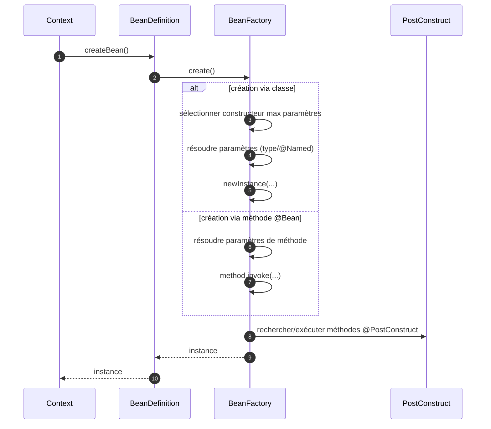
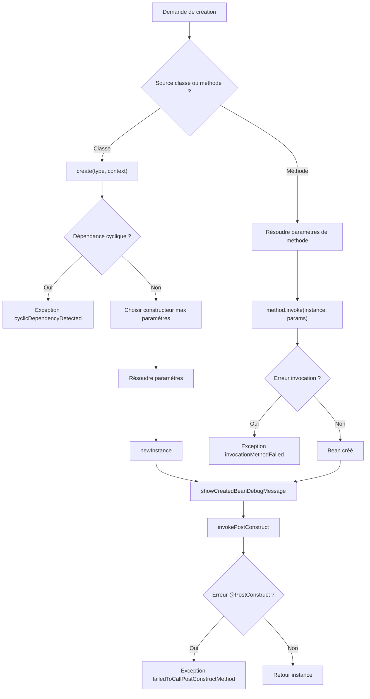

# ⚙️ BeanFactory (infrastructure.factory)

> 📘 Documentation technique orientée maintenance et évolution.

## 1) 🧭 Vue d'ensemble

`BeanFactory` est la classe responsable de la **création effective des instances de beans**.
Elle intervient après la phase de description (`BeanDefinition`) pour :

- ✅ résoudre les dépendances de constructeurs et de méthodes ;
- ⚙️ instancier les beans (méthode `@Bean` ou constructeur de classe) ;
- 🔁 détecter les cycles de dépendances ;
- 🧩 exécuter les `@PostConstruct` compatibles avec le profil actif ;
- 📝 produire des traces de création en mode debug.

Fichier source : `src/main/java/com/jasonpercus/microbean/infrastructure/factory/BeanFactory.java`

---

## 2) 🔗 Positionnement dans le flux MicroBean

`BeanFactory` est utilisée par `BeanDefinition`, puis consommée par `Context` :

1. `Processor` enregistre des `BeanDefinition` dans `Context`.
2. `Context.getBean(...)` choisit une définition.
3. `BeanDefinition.createBean()` délègue à `BeanFactory.create()`.
4. `BeanFactory` instancie, injecte, exécute les `@PostConstruct`, puis retourne l'objet.

Références :

- `src/main/java/com/jasonpercus/microbean/infrastructure/factory/BeanDefinition.java`
- `src/main/java/com/jasonpercus/microbean/infrastructure/factory/Context.java`
- `src/main/java/com/jasonpercus/microbean/infrastructure/run/Processor.java`

### 🧵 Diagramme de séquence

---

## 3) 💡 Idée fonctionnelle : à quoi répond cette classe

`BeanFactory` répond au besoin suivant :
**créer des objets IoC de manière cohérente, sûre et observable**.

Les contraintes prises en charge sont :

- injection automatique des paramètres ;
- injection nommée via `@Named` ;
- anti-cycle avec suivi thread-local ;
- cycle de vie post-initialisation (`@PostConstruct`) ;
- compatibilité profil sur `@PostConstruct` (`@Profile`).

Sans cette classe, la création des beans serait dispersée et difficile à fiabiliser.

---

## 4) 🧠 Comportement méthode par méthode

### `BeanFactory(Object instance, Method method, Context context)`

- Configure une stratégie de création basée sur une méthode `@Bean`.
- Résout les paramètres de la méthode depuis le `Context`.
- Invoque la méthode via réflexion.
- Encapsule toute erreur d'invocation via `invocationMethodFailed(...)`.

### `BeanFactory(Class<T> type, Context context)`

- Configure une stratégie de création basée sur une classe.
- Délègue à `BeanFactory.create(type, context)`.

### `T create()`

- Exécute la stratégie de création injectée au constructeur.

### `static <T> T create(Class<T> type, Context context)`

- Détecte les cycles via `CONSTRUCTING` (thread-local).
- Sélectionne le constructeur avec le plus de paramètres.
- Résout les paramètres.
- Délègue à `create(constructor, parameters)`.
- Encapsule les erreurs via `failedToCreateBean(...)`.

### `static <T> T create(Constructor<T> constructor, Object[] parameters)`

- Instancie l'objet (`newInstance`).
- Émet la trace de debug de création (si activée).
- Exécute les `@PostConstruct`.

### `invokePostConstruct(...)`

- Parcourt la classe, la hiérarchie et les interfaces.
- Filtre les méthodes `@PostConstruct` compatibles avec le profil actif.
- Déduplique par signature (`MethodSignature`).
- Invoque chaque méthode retenue.

### `resolveParameter(...)` / `createParameters(...)`

- Résolution par type par défaut.
- Résolution par nom si `@Named` est présent.

### `showCreatedBeanDebugMessage(...)` / `listObjectNames(...)`

- Construit et affiche un message de debug lisible avec classes abrégées.

### `matchesActiveProfile(...)`

- Si la méthode n'a pas `@Profile` : autorisée.
- Sinon : délégation à `ProfileValidator`.

### `getBeanConstructorWithMaxParameters(...)`

- Choisit le constructeur le plus "riche" en paramètres.

### `MethodSignature`

- Classe interne de déduplication des méthodes `@PostConstruct`.
- Égalité basée sur `name + paramTypes`.

### 🌊 Diagramme de flux (création de bean)

---

## 5) 📐 Contrats implicites importants (pour la maintenance)

- Le contrôle anti-cycle repose sur `CONSTRUCTING` et doit rester thread-local.
- Le constructeur choisi est celui avec le plus de paramètres (règle actuelle explicite).
- Les `@PostConstruct` sont filtrés par profil actif.
- Les signatures `@PostConstruct` doivent rester dédupliquées via `MethodSignature`.
- Les erreurs sont toujours encapsulées par `ExceptionManager`.

---

## 6) ⚠️ Risques lors des modifications

1. **Détection de cycle** : toute modification de `CONSTRUCTING` peut réintroduire des boucles infinies.
2. **Choix du constructeur** : changer la stratégie peut casser des injections existantes.
3. **PostConstruct** : enlever la déduplication peut provoquer des doubles invocations.
4. **@Named** : une régression sur `resolveParameter(...)` casse les injections qualifiées.
5. **Traces debug** : les tests et diagnostics dépendent du format des messages.

> 🛡️ Recommandation : sur toute évolution, rejouer `BeanFactoryTest` puis les scénarios Cucumber `@beanfactory`.

---

## 7) 🧪 Tests existants sur `BeanFactory`

### 7.1 ✅ Tests unitaires

Fichier : `src/test/java/com/jasonpercus/microbean/infrastructure/factory/BeanFactoryTest.java`

Couverture actuelle (principale) :

- création via méthode `@Bean` + injection ;
- erreur d'invocation de méthode `@Bean` ;
- choix du constructeur avec le plus de paramètres ;
- résolution `@Named` ;
- exécution `@PostConstruct` (classe/superclasse/interface) ;
- filtrage `@PostConstruct` par profil ;
- erreur `@PostConstruct` ;
- erreur constructeur ;
- dépendance cyclique ;
- traces debug de création ;
- formatage `listObjectNames(...)` ;
- comparaison `MethodSignature.equals/hashCode`.

### 7.2 🥒 Scénarios Cucumber

Fichier : `src/test/resources/com/jasonpercus/microbean/cucumber/bean-factory.feature`

Scénarios définis :

1. création via méthode `@Bean` avec injection ;
2. utilisation du constructeur avec le plus de paramètres ;
3. résolution d'une dépendance nommée ;
4. exécution des `@PostConstruct` hérités ;
5. erreur quand un `@PostConstruct` échoue.

Steps associées : `src/test/java/com/jasonpercus/microbean/cucumber/steps/MicroBeanStepdefinitions.java`

Fixtures associées : `src/test/java/com/jasonpercus/microbean/cucumber/jdt/factory/beanfactory/BeanFactoryFixtures.java`

---

## 8) 🧰 Ce qu'un mainteneur doit retenir

- `BeanFactory` est la classe qui transforme une définition en instance concrète.
- Elle concentre les sujets sensibles : cycle, injection, post-init, profil, debug.
- Les helpers internes (`resolveParameter`, `matchesActiveProfile`, `MethodSignature`) sont critiques.
- Toute évolution doit rester alignée avec `BeanDefinition` et `Context`.

---

## 9) 🗺️ Légende visuelle rapide

- ✅ Validation / conformité
- 🔎 Résolution / injection
- ⚙️ Création / instanciation
- ⚠️ Point de vigilance
- 🧪 Couverture de tests
- 🛡️ Recommandation de fiabilité
