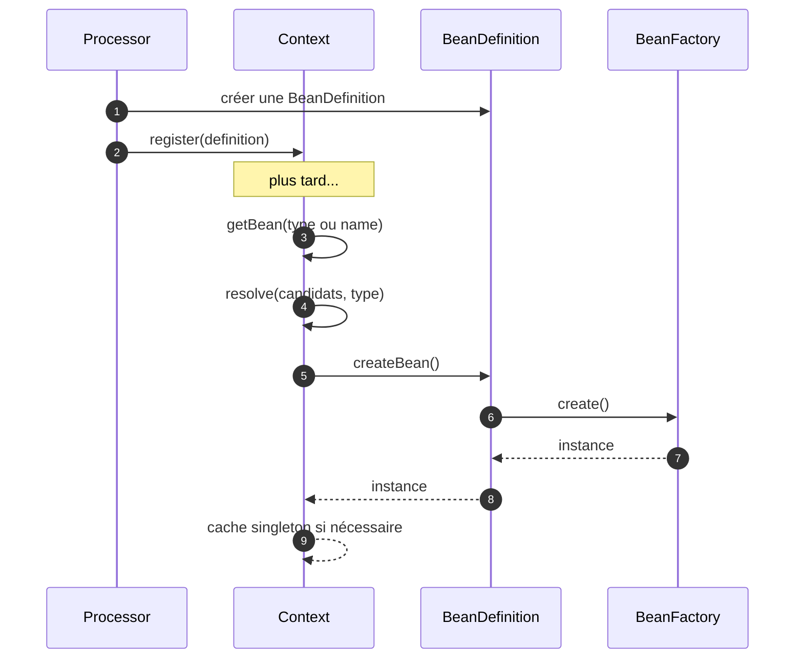
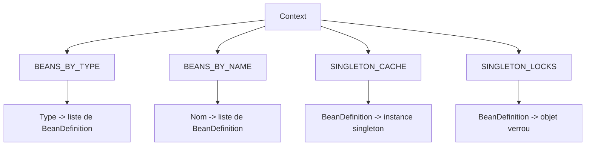
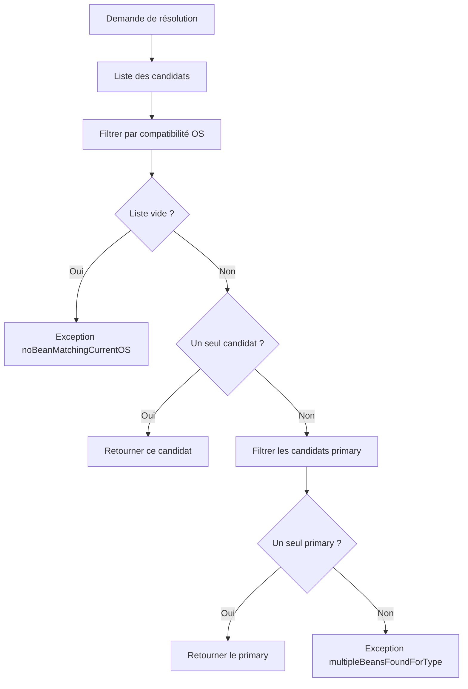
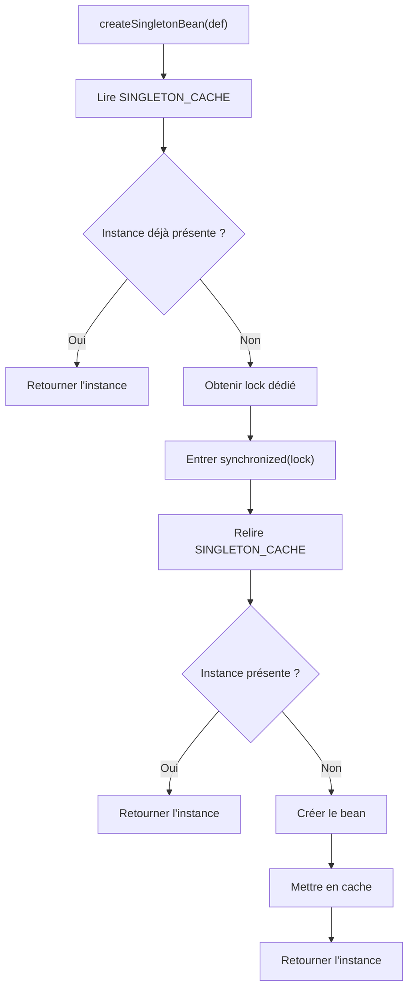

# 🧭 Context (infrastructure.factory)

> 📘 Documentation technique orientée maintenance, compréhension fonctionnelle et évolution.

## 1) 🌍 Vue d’ensemble

`Context` est le **registre central de résolution des beans** dans MicroBean.

C’est lui qui :
- 📦 enregistre les `BeanDefinition`,
- 📌 peut enregistrer des singletons déjà construits (`registerSingleton`),
- 🔎 les indexe par **type** et par **nom**,
- 🧠 choisit la bonne définition lorsqu’il y a plusieurs candidats,
- 🖥️ filtre les beans incompatibles avec le système d’exploitation courant,
- 🏷️ privilégie un bean `@Primary` en cas d’ambiguïté,
- ♻️ gère le cycle de vie **singleton** vs **prototype**,
- 🔐 sécurise la création des singletons en environnement concurrent.

Autrement dit, `Context` répond à la question :

> **“Quand une dépendance est demandée, quel bean faut-il fournir, et comment faut-il le créer ?”**

Fichier source : `src/main/java/com/jasonpercus/microbean/infrastructure/factory/Context.java`

---

## 2) 🔗 Positionnement dans le flux MicroBean

`Context` se situe entre la **description** d’un bean (`BeanDefinition`) et sa **création effective** (`BeanFactory`).

### Flux simplifié

1. `Processor` détecte les composants applicatifs.
2. `Processor` crée des `BeanDefinition`.
3. `Processor` enregistre ces définitions dans `Context`.
4. `Initializer` préenregistre aussi le singleton runtime `Environment`.
5. Une demande de bean arrive via `getBean(...)`.
6. `Context` résout la bonne définition.
7. `Context` délègue à `BeanDefinition#createBean()`.
8. `BeanDefinition` s’appuie sur `BeanFactory` pour créer l’instance.
9. `Context` met éventuellement l’instance en cache si le scope est `SINGLETON`.

### Références

- `src/main/java/com/jasonpercus/microbean/infrastructure/run/Processor.java`
- `src/main/java/com/jasonpercus/microbean/infrastructure/factory/BeanDefinition.java`
- `src/main/java/com/jasonpercus/microbean/infrastructure/factory/BeanFactory.java`

### 🧵 Diagramme de séquence



---

## 3) 💡 Idée générale et fonctionnelle

### À quoi répond cette classe ?

Dans un conteneur IoC, plusieurs difficultés apparaissent rapidement :

- plusieurs beans peuvent exposer le même contrat ;
- un bean peut être demandé par **type** ou par **nom** ;
- certains beans ne sont valides que sur un **OS donné** ;
- certains beans doivent être des **singletons**, d’autres des **prototypes** ;
- plusieurs threads peuvent demander le même singleton en même temps.

`Context` centralise toutes ces règles.

### En pratique, `Context` apporte

- ✅ une **résolution uniforme** des dépendances ;
- ✅ un **point unique de vérité** pour les définitions enregistrées ;
- ✅ une **gestion cohérente des ambiguïtés** ;
- ✅ une **création paresseuse** des instances ;
- ✅ une **sécurisation concurrente** des singletons.

Sans cette classe, la logique de sélection et de création serait dispersée dans le framework, plus difficile à maintenir, et plus fragile.

---

## 4) 🏗️ Structure interne

`Context` repose sur 4 structures principales :

### `BEANS_BY_TYPE`
```java
private final Map<Class<?>, List<BeanDefinition<?>>> BEANS_BY_TYPE;
```

- 📚 Index principal par type.
- Permet de résoudre `getBean(MyType.class)`.

### `BEANS_BY_NAME`
```java
private final Map<String, List<BeanDefinition<?>>> BEANS_BY_NAME;
```

- 🏷️ Index secondaire par nom.
- Permet de résoudre `getBean(MyType.class, "monBean")`.

### `SINGLETON_CACHE`
```java
private final Map<BeanDefinition<?>, Object> SINGLETON_CACHE;
```

- ♻️ Stocke les instances singleton déjà créées.
- Évite de recréer plusieurs fois le même bean singleton.

### `SINGLETON_LOCKS`
```java
private final Map<BeanDefinition<?>, Object> SINGLETON_LOCKS;
```

- 🔐 Fournit un verrou dédié par définition de bean.
- Garantit qu’un singleton ne soit créé qu’une seule fois, même sous forte concurrence.

### 🧩 Diagramme de structure



---

## 5) 🧠 Comportement méthode par méthode

## 5.0 📂 Accès aux classes scannées

### `getComponentClasses()`

- Retourne l'ensemble **immuable** des classes annotées "component" transmises au constructeur par le `Processor`.
- Correspond aux classes qui passeront par le pipeline d'enregistrement des beans.
- L'ensemble est trié (basé sur un `SortedSet`) et non modifiable (`Collections.unmodifiableSortedSet`).
- Toute tentative de modification lève `UnsupportedOperationException`.

### `getOtherClasses()`

- Retourne l'ensemble **immuable** des autres classes annotées (non-composants) validées par les modules `@ModuleInit`.
- Ces classes ne sont pas enregistrées comme beans injectables, mais sont transmises au contexte pour un usage module-spécifique.
- Même garanties que `getComponentClasses()` : immuable, trié.

---

### `register(BeanDefinition<?> beanDefinition)`

Cette méthode enregistre une définition :

- sur son **type principal** ;
- éventuellement sur son **nom** si celui-ci n’est pas vide ;
- sur toutes les **interfaces** implémentées ;
- sur la **superclasse** directe, si elle existe et n’est pas `Object`.

👉 Cela permet qu’un même bean soit résoluble via :
- sa classe concrète,
- une interface métier,
- une superclasse,
- un nom explicite.

### `registerSingleton(Class<T> type, T instance)`

- enregistre une instance déjà construite comme singleton injectable ;
- encapsule l'instance dans une `BeanDefinition` adaptée ;
- sert notamment au bootstrap runtime pour exposer `Environment` dès le démarrage.

### `registerBeanDefinitionForType(...)`

- ajoute la définition dans `BEANS_BY_TYPE` ;
- crée la liste si elle n’existe pas encore.

### `registerBeanDefinitionForName(...)`

- ajoute la définition dans `BEANS_BY_NAME` ;
- crée la liste si nécessaire.

### `isNotEmptyBeanDefinitionName(...)`

- indique si le bean possède un nom exploitable ;
- évite d’indexer des noms vides.

### `register(Class<?> type, BeanDefinition<?> beanDefinition)`

Variante plus explicite : elle enregistre la définition sur un type donné, puis propage aussi :
- les interfaces du type,
- sa superclasse.

Cette méthode est utile lorsque l’on souhaite exposer une définition sous un contrat précis.

---

## 5.2 🔎 Résolution des beans

### `getBean(Class<?> type)`

Résolution par type :

1. cherche les définitions dans `BEANS_BY_TYPE`,
2. échoue si aucune définition n’existe,
3. appelle `resolve(...)`,
4. crée l’instance selon le scope.

### `getBean(Class<?> expectedType, String name)`

Résolution par type attendu + nom :

1. cherche les définitions portant ce nom,
2. échoue si le nom est inconnu,
3. filtre les définitions assignables au type attendu,
4. échoue si aucune n’est compatible,
5. appelle `resolve(...)`,
6. crée l’instance selon le scope.

### `validateResolvable(Class<?> type)`

Même logique que `getBean(Class<?>)`, mais **sans créer le bean**.

Elle sert à vérifier qu’une résolution est possible, sans provoquer d’instanciation.

### `validateResolvable(Class<?> expectedType, String name)`

Même principe pour une résolution par nom.

### `getBeansByAnnotation(Class<? extends Annotation> annotationType)`

- parcourt les définitions enregistrées ;
- conserve celles dont la classe est annotée par `annotationType` ;
- retourne les **instances** correspondantes via `getBean(...)`.

### `getBeanTypesByAnnotation(Class<? extends Annotation> annotationType)`

- parcourt les définitions enregistrées ;
- conserve celles dont la classe est annotée par `annotationType` ;
- retourne les **types** correspondants sans instanciation.

---

## 5.3 🎯 Sélection du bon candidat

### `resolve(List<BeanDefinition<?>> beanDefinitions, Class<?> forType)`

C’est la méthode stratégique du `Context`.

Ordre de sélection :

1. 🖥️ filtrer les candidats compatibles avec l’OS courant ;
2. ✅ s’il n’en reste qu’un, le retourner ;
3. 🏷️ sinon filtrer les beans `@Primary` ;
4. ✅ s’il n’existe qu’un seul primaire, le retourner ;
5. ❌ sinon lever une erreur d’ambiguïté.

### Règles métiers importantes

- Un bean non compatible OS est **ignoré**.
- Le bean primaire ne sert qu’en cas de **pluralité de candidats**.
- S’il reste plusieurs candidats sans primaire unique, la résolution est considérée **ambiguë**.

### `getBeanDefinitionsCompatibleWithCurrentOS(...)`

- délègue à `OperatingSystemHelper.isCompatibleWithCurrentOS(...)` ;
- applique le filtre OS sur les candidats.

### `getPrimaryBeanDefinitionList(...)`

- extrait uniquement les définitions marquées `primary`.

### `getBeanDefinitionsAssignableToType(...)`

- ne conserve que les définitions dont le type est assignable au type attendu.

### `getFirstBeanDefinitionInList(...)`

- retourne le premier élément d’une liste non vide ;
- helper simple mais important car utilisé dans les cas nominaux.

### 🌊 Diagramme de décision de résolution



---

## 5.4 ♻️ Création selon le scope

### `createSingletonOrPrototypeBean(...)`

- si le scope vaut `SINGLETON` → délègue à `createSingletonBean(...)`,
- sinon → délègue à `createPrototypeBean(...)`.

### `createPrototypeBean(...)`

- crée systématiquement une nouvelle instance ;
- aucun cache n’est utilisé.

### `createSingletonBean(...)`

Cette méthode garantit le comportement singleton.

Algorithme :

1. lire le cache ;
2. si l’instance existe déjà, la retourner immédiatement ;
3. sinon récupérer/créer un verrou dédié à la définition ;
4. entrer en section synchronisée ;
5. relire le cache (double vérification) ;
6. si l’instance est maintenant présente, la retourner ;
7. sinon créer le bean ;
8. l’ajouter au cache ;
9. retourner l’instance.

👉 Le **double check** est volontaire : il évite qu’un autre thread ait déjà créé le singleton juste avant l’acquisition du verrou.

### `createBean(...)`

- délègue simplement à `beanDefinition.createBean()` ;
- la logique réelle d’instanciation est donc externalisée dans `BeanDefinition`, puis `BeanFactory`.

### 🔐 Diagramme de création singleton



---

## 5.5 🛠️ Helpers techniques

### `getInterfacesForType(...)`
Retourne les interfaces directes du type.

### `getSuperclassForType(...)`
Retourne la superclasse directe.

### `getInterfacesForBeanDefinition(...)`
Retourne les interfaces du type principal de la définition.

### `getSuperclassForBeanDefinition(...)`
Retourne la superclasse du type principal de la définition.

### `getBeanDefinitionInSingletonCache(...)`
Lecture du cache singleton.

### `addBeanDefinitionInSingletonCache(...)`
Écriture dans le cache singleton.

### `createBeanList(...)`
Fabrique une nouvelle liste vide de `BeanDefinition` (paramètre présent pour compatibilité avec `computeIfAbsent`).

Ces helpers ont une utilité importante : ils rendent la classe **testable** en isolant les micro-comportements.

---

## 6) 📐 Contrats implicites importants

Voici les règles qu’un mainteneur doit considérer comme faisant partie du contrat de la classe :

1. **Une définition peut être enregistrée sous plusieurs clés**
    - type concret,
    - interface,
    - superclasse,
    - nom éventuel.

2. **La résolution par nom reste typée**
    - un nom trouvé mais incompatible avec le type attendu doit être rejeté.

3. **Le filtre OS est appliqué avant la logique `@Primary`**
    - un bean primaire incompatible OS ne doit pas être retenu.

4. **Le singleton est paresseux**
    - l’instance n’est créée qu’au premier accès.

5. **Le singleton est protégé contre les accès concurrents**
    - la création ne doit se produire qu’une seule fois.

6. **Le prototype n’est jamais mis en cache**
    - chaque appel retourne une nouvelle instance.

7. **Les exceptions sont produites via `ExceptionManager`**
    - cela garantit des messages homogènes dans tout le framework.

8. **Les singletons préenregistrés restent résolus comme les autres beans**
    - ils participent aux mêmes règles de résolution par type/nom.

---

## 7) ⚠️ Risques lors des modifications

### 1. Modifier la stratégie de résolution
Si l’ordre OS → candidat unique → primary change, on risque de casser des comportements métier existants.

### 2. Modifier l’indexation par hiérarchie
Une évolution sur `register(...)` peut rendre certains beans introuvables via leurs interfaces ou superclasses.

### 3. Toucher au cache singleton
Un changement sur `createSingletonBean(...)` peut :
- créer plusieurs instances au lieu d’une,
- introduire des conditions de course,
- dégrader les performances.

### 4. Modifier la résolution par nom
Il ne faut pas oublier que `getBean(type, name)` est une résolution **doublement contrainte** :
- par le nom,
- puis par l’assignabilité du type.

### 5. Sous-estimer les helpers
Des méthodes comme `getBeanDefinitionsAssignableToType(...)` ou `getPrimaryBeanDefinitionList(...)` paraissent simples, mais elles supportent directement la stratégie de résolution.

> 🛡️ Recommandation : toute évolution de `Context` doit être validée à minima avec `ContextTest`, `ContextThreadSafetyTest` et les scénarios Cucumber de `context.feature`.

---

## 8) 🧪 Tests existants sur `Context`

## 8.1 ✅ Tests unitaires principaux

Fichier : `src/test/java/com/jasonpercus/microbean/infrastructure/factory/ContextTest.java`

Les tests unitaires couvrent notamment :

### Résolution nominale
- récupération d'un bean par type ;
- récupération d'un bean par nom + type ;
- récupération des beans par annotation (`getBeansByAnnotation`) ;
- récupération des types par annotation (`getBeanTypesByAnnotation`) ;
- validation de résolvabilité par type et par nom.

### Accès aux classes scannées
- `getComponentClasses()` retourne un ensemble vide quand le contexte est créé sans classes ;
- `getComponentClasses()` retourne exactement les classes passées au constructeur ;
- `getComponentClasses()` retourne un ensemble non modifiable (`UnsupportedOperationException`) ;
- `getOtherClasses()` retourne un ensemble vide quand le contexte est créé sans autres classes ;
- `getOtherClasses()` retourne exactement les autres classes passées au constructeur ;
- `getOtherClasses()` retourne un ensemble non modifiable ;
- indépendance entre `componentClasses` et `otherClasses` (pas de pollution croisée).

> Ces tests valident le contrat d'accès en lecture au registre des classes scannées, ainsi que l'immuabilité garantie par `Collections.unmodifiableSortedSet`.

---

### Cas d’erreur
- aucun bean trouvé pour un type ;
- aucune définition trouvée pour un nom ;
- liste enregistrée mais vide côté type ;
- liste enregistrée mais vide côté nom ;
- nom trouvé mais type non assignable ;
- ambiguïté quand plusieurs candidats existent sans primaire ;
- aucun candidat compatible avec l’OS courant.

### Sélection métier
- choix du bean `@Primary` quand plusieurs candidats exposent le même contrat ;
- filtrage correct des définitions assignables ;
- récupération du premier élément de liste ;
- extraction correcte des définitions primaires ;
- recherche par annotation (cas positif, cas vide, plusieurs classes annotées).

### Scopes
- singleton : la même instance est retournée ;
- prototype : deux instances différentes sont retournées.

### Enregistrement hiérarchique
- exposition via interface ;
- exposition via superclasse ;
- cas particulier où la superclasse est `null` ;
- cas où le type enregistré est une interface ;
- enregistrement depuis une `BeanDefinition` ;
- enregistrement depuis un type explicite.

### Cache singleton et double vérification
- retour immédiat depuis le cache ;
- second check dans le bloc synchronisé ;
- création puis mise en cache ;
- non-récréation du singleton lorsqu’il existe déjà.

👉 Ces tests valident donc à la fois :
- la logique métier de résolution,
- les chemins d’erreur,
- les helpers internes,
- les comportements de cache.

---

## 8.2 🔐 Tests unitaires de concurrence

Fichier : `src/test/java/com/jasonpercus/microbean/infrastructure/factory/ContextThreadSafetyTest.java`

Ce test vérifie que :
- plusieurs threads peuvent demander le même bean singleton simultanément ;
- une seule instance est réellement créée ;
- tous les threads récupèrent la même référence.

C’est un test très important, car il protège le contrat de **thread-safety** de `createSingletonBean(...)`.

---

## 8.3 🥒 Scénarios Cucumber

Fichier : `src/test/resources/com/jasonpercus/microbean/cucumber/context.feature`

Scénarios actuellement présents :

1. **Résoudre un bean simple par type**
    - valide le cas nominal singleton ;
    - vérifie aussi que la même instance est retournée.

2. **Résoudre un bean prototype par type**
    - valide la création d’instances distinctes.

3. **Résoudre le bean primaire quand plusieurs candidats implémentent le même contrat**
    - vérifie la priorité du bean `@Primary`.

4. **Lever une erreur quand plusieurs candidats existent sans primaire**
    - valide l’ambiguïté de résolution.

5. **Lever une erreur quand le bean nommé n’existe pas**
    - vérifie l’échec de la résolution par nom.

Steps associées :
- `src/test/java/com/jasonpercus/microbean/cucumber/steps/MicroBeanStepdefinitions.java`

Fixtures associées :
- `src/test/java/com/jasonpercus/microbean/cucumber/jdt/context/ContextFixtures.java`

### Ce que les scénarios Cucumber apportent

Les tests unitaires valident finement la mécanique interne.  
Les scénarios Cucumber, eux, valident la **lecture fonctionnelle** du comportement de `Context` :

- “je demande un bean” ;
- “le bon bean est retourné” ;
- “le singleton reste unique” ;
- “le prototype recrée une instance” ;
- “l’ambiguïté ou l’absence de bean produit une erreur lisible”.

---

## 9) 🧰 Ce qu’un mainteneur doit retenir

### En une phrase
`Context` est le **chef d’orchestre de la résolution des dépendances** dans MicroBean.

### À retenir absolument
- 🧠 il ne crée pas directement la logique métier d’instanciation : il **oriente** et **délègue** ;
- 📌 il peut aussi exposer des instances pre-construites (ex: `Environment`) ;
- 🔎 il décide **quel bean** doit être utilisé ;
- ♻️ il décide **si l’instance doit être cachée** ou recréée ;
- 🔐 il protège la création des singletons contre les accès concurrents ;
- 🏷️ il gère les règles d’ambiguïté (`@Primary`, nom, type, OS).

### Si vous devez modifier cette classe
Commencez toujours par vous poser ces 4 questions :

1. **Est-ce que je change la manière d’enregistrer les définitions ?**
2. **Est-ce que je change la stratégie de sélection d’un candidat ?**
3. **Est-ce que je change le comportement singleton / prototype ?**
4. **Est-ce que mon changement reste sûr en concurrence ?**

Si l’une de ces réponses est “oui”, il faut rejouer et compléter les tests avant validation.

---

## 10) 🗺️ Légende visuelle rapide

- 📦 Enregistrement
- 🔎 Résolution
- 🏷️ Sélection métier
- 🖥️ Compatibilité OS
- ♻️ Gestion des scopes
- 🔐 Concurrence / thread-safety
- ⚠️ Point de vigilance
- 🧪 Couverture de tests
- 🛡️ Recommandation de maintenance
