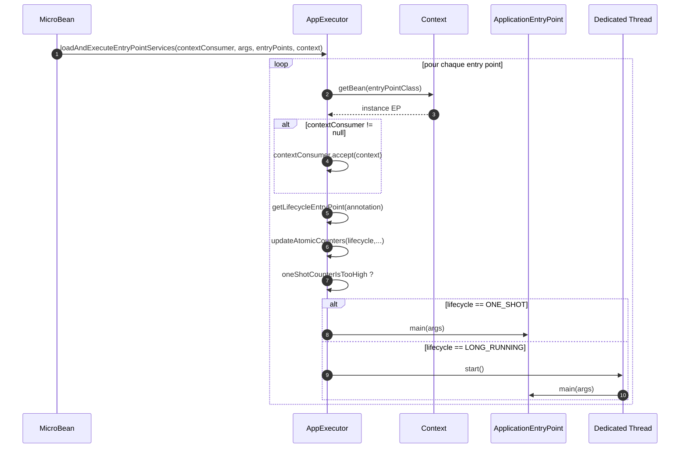
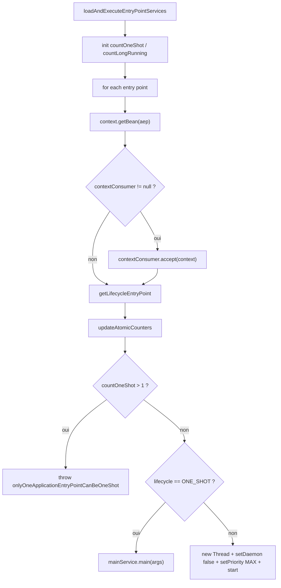

# ⚙️ AppExecutor (infrastructure.run)

> 📘 Documentation technique orientée maintenance et évolution.

## 1) 🧭 Vue d'ensemble

`AppExecutor` est la classe chargée de **résoudre, préparer et exécuter les entry points applicatifs** à la fin du bootstrap MicroBean.

Son rôle commence une fois que :

- la bannière a été affichée ;
- l'initialisation a produit le `Context` et la liste des classes ;
- le `Processor` a enregistré les beans nécessaires.

Responsabilités principales :

- ✅ charger les `ApplicationEntryPoint` depuis le `Context` ;
- 🧭 déterminer leur cycle de vie réel (`ONE_SHOT` ou `LONG_RUNNING`) ;
- ▶️ exécuter les entry points sur le bon thread ;
- 🧱 exécuter éventuellement un `Consumer<Context>` avant chaque lancement ;
- ⚠️ garantir qu'il n'existe pas plus d'un entry point `ONE_SHOT` par exécution.

Fichier source : `src/main/java/com/jasonpercus/microbean/infrastructure/run/AppExecutor.java`

---

## 2) 🔗 Positionnement dans le flux MicroBean

`AppExecutor` intervient à la fin du pipeline principal :

1. `Banner.show(appClass)`
2. `Initializer.init(appClass, args, appEntryPoint)`
3. `Processor.execute(initializer.getClasses(), context, args)`
4. `AppExecutor.loadAndExecuteEntryPointServices(contextConsumer, args, appEntryPoint, context)`

Il est donc la **dernière étape d'orchestration technique avant l'exécution du code applicatif visible**.

Référence d'orchestration : `src/main/java/com/jasonpercus/microbean/MicroBean.java`

### 🧵 Diagramme de séquence (vue d'ensemble)

---

## 3) 💡 Idée fonctionnelle : à quoi répond cette classe

`AppExecutor` répond à la question suivante :

> **« Une fois le conteneur prêt, comment lancer proprement les points d'entrée de l'application ? »**

Le framework doit supporter deux modes :

- un mode **synchrone** pour un entry point principal de type `ONE_SHOT` ;
- un mode **asynchrone** pour des entry points de type `LONG_RUNNING`.

Il doit aussi garantir une règle métier importante :

- **un seul** `ApplicationEntryPoint` peut être `ONE_SHOT` lors d'un même démarrage.

Sans cette classe, la phase de bootstrap s'arrêterait au câblage des beans, sans déclencher l'exécution applicative réelle.

---

## 4) 🧠 Comportement méthode par méthode

### `public static void loadAndExecuteEntryPointServices(Consumer<Context> contextConsumer, String[] args, Class<? extends ApplicationEntryPoint>[] appEntryPoint, Context context)`

- Point d'entrée principal.
- Initialise deux compteurs atomiques :
  - `countOneShot`
  - `countLongRunning`
- Trie d'abord les entry points via `compareEntryPointsByLifecycle(...)` pour traiter
  les `LONG_RUNNING` avant les `ONE_SHOT`.
- Délègue chaque traitement à `prepareAndExecuteEntryPointService(...)`.

> ⚠️ Ce tri est intentionnel : il garantit que les threads des entry points
> `LONG_RUNNING` sont bien démarrés avant l'exécution d'un `ONE_SHOT` potentiellement
> terminal pour le processus appelant.

### `private static void prepareAndExecuteEntryPointService(...)`

Séquence interne :

1. Résout le bean entry point via `context.getBean(aep)`.
2. Exécute `contextConsumer.accept(context)` si un consumer est fourni.
3. Récupère l'annotation `@EntryPointService` portée par la classe.
4. Déduit le cycle de vie via `getLifecycleEntryPoint(...)`.
5. Met à jour les compteurs via `updateAtomicCounters(...)`.
6. Vérifie la contrainte d'unicité `ONE_SHOT`.
7. Lance l'exécution réelle via `executeEntryPointService(...)`.

### `private static LifecycleEntryPoint getLifecycleEntryPoint(EntryPointService entryPointAnnotation)`

- Si l'annotation est absente : retourne `ONE_SHOT` par défaut.
- Sinon : retourne `entryPointAnnotation.lifecycle()`.

> ⚠️ Remarque : ce fallback existe dans `AppExecutor`, même si le flux public complet du framework valide normalement les entry points en amont.

### `private static void executeEntryPointService(String[] args, LifecycleEntryPoint lifecycle, ApplicationEntryPoint mainService)`

Deux comportements :

#### Cas `ONE_SHOT`

- exécution synchrone ;
- appel direct à `mainService.main(args)` ;
- l'exécution se fait sur le thread appelant.

#### Cas `LONG_RUNNING`

- création d'un nouveau `Thread` ;
- thread marqué `daemon=false` ;
- priorité fixée à `MAX_PRIORITY` ;
- démarrage via `thread.start()` ;
- l'exécution effective de `main(args)` se fait sur ce thread dédié.

### `private static void updateAtomicCounters(...)`

- incrémente `countOneShot` si le lifecycle vaut `ONE_SHOT` ;
- incrémente `countLongRunning` sinon.

### `private static boolean oneShotCounterIsTooHigh(AtomicInteger countOneShot)`

- retourne `true` si le compteur `ONE_SHOT` dépasse `1` ;
- matérialise la contrainte métier d'unicité du point d'entrée synchrone.

### Tableau de décision simplifié

| Annotation / cycle                 | Exécution           | Thread          | Effet                        |
|------------------------------------|---------------------|-----------------|------------------------------|
| `@EntryPointService(ONE_SHOT)`     | synchrone           | thread appelant | `main(args)` immédiat        |
| `@EntryPointService(LONG_RUNNING)` | asynchrone          | thread dédié    | `main(args)` après `start()` |
| sans annotation                    | fallback `ONE_SHOT` | thread appelant | comportement par défaut      |
| second `ONE_SHOT` détecté          | exception           | n/a             | arrêt du traitement          |

### 🌊 Diagramme de flux interne

---

## 5) 📐 Contrats implicites importants (pour la maintenance)

- ✅ Les entry points sont **résolus comme des beans** depuis le `Context`, pas instanciés directement.
- ✅ Le `contextConsumer`, s'il existe, est exécuté **avant chaque entry point**, pas une seule fois globalement.
- ✅ Le fallback sans annotation est `ONE_SHOT`.
- ✅ Un seul entry point `ONE_SHOT` est autorisé par lancement.
- ✅ Les `LONG_RUNNING` doivent être ordonnés avant les `ONE_SHOT` pour garantir
  l'appel à `start()` de leurs threads dédiés.
- ✅ Les entry points `LONG_RUNNING` sont exécutés sur un thread dédié **non daemon** et de priorité maximale.
- ✅ `AppExecutor` ne gère pas la synchronisation d'arrêt des threads `LONG_RUNNING` : il ne fait que les lancer.

---

## 6) ⚠️ Risques lors des modifications

1. **Modifier l'ordre de tri/exécution des entry points** peut empêcher le démarrage des `LONG_RUNNING` si un `ONE_SHOT` est lancé trop tôt.
2. **Retirer le fallback `ONE_SHOT`** casserait les appels directs à `AppExecutor` hors pipeline complet.
3. **Supprimer la contrainte d'unicité `ONE_SHOT`** introduirait une ambiguïté dans le modèle d'exécution.
4. **Changer la configuration du thread `LONG_RUNNING`** (`daemon`, priorité) peut modifier le comportement runtime et les garanties actuelles.
5. **Exécuter `contextConsumer` une seule fois globalement** casserait le contrat actuellement vérifié par les tests.

---

## 7) 🧪 Tests existants sur `AppExecutor`

### 7.1 ✅ Tests unitaires

Fichier : `src/test/java/com/jasonpercus/microbean/infrastructure/run/AppExecutorTest.java`

Les tests unitaires couvrent les points suivants.

#### Exécution `ONE_SHOT`

- exécution sur le thread appelant ;
- transmission correcte des arguments ;
- résolution du bean depuis `Context`.

#### Fallback sans annotation

- un entry point non annoté est traité comme `ONE_SHOT`.

#### Exécution `LONG_RUNNING`

- exécution sur un thread dédié ;
- thread distinct du thread appelant ;
- priorité du thread fixée à `MAX_PRIORITY` ;
- arguments correctement transmis.

#### `contextConsumer`

- appelé une fois par entry point traité ;
- reçoit bien le `Context` courant.

#### Contrainte d'unicité `ONE_SHOT`

- levée d'une `MicroBeanException` si plus d'un entry point est `ONE_SHOT` ;
- le second entry point n'est pas exécuté.

### 7.2 🥒 Tests Cucumber (intégration comportementale)

Fichier : `src/test/resources/com/jasonpercus/microbean/cucumber/app-executor.feature`

Steps centralisés dans :
`src/test/java/com/jasonpercus/microbean/cucumber/steps/MicroBeanStepdefinitions.java`

Les scénarios Cucumber couvrent les comportements observables via le flux public `MicroBean` :

- exécution d'un entry point `ONE_SHOT` au premier plan ;
- exécution d'un entry point `LONG_RUNNING` en arrière-plan ;
- propagation des arguments jusqu'aux entry points ;
- exécution du `contextConsumer` une fois par entry point ;
- levée d'une erreur si plusieurs entry points sont `ONE_SHOT`.

#### Complémentarité des deux niveaux de test

- les **tests unitaires** valident les détails techniques internes (`Context`, thread, priorité, compteurs) ;
- les **tests Cucumber** valident le comportement observable dans le flux public du framework (`MicroBean.run(...)`).

Ensemble, ils verrouillent à la fois le **contrat d'implémentation** et le **contrat fonctionnel visible**.

---

## 8) 🧰 Ce qu'un mainteneur doit retenir

- `AppExecutor` est la **dernière étape du bootstrap**, celle qui déclenche réellement l'application.
- Le comportement central repose sur la distinction `ONE_SHOT` / `LONG_RUNNING`.
- Le `contextConsumer` est exécuté **par entry point**, ce qui est un contrat important.
- L'unicité de `ONE_SHOT` est une règle métier structurante.
- Toute modification doit être rejouée contre les tests unitaires **et** les scénarios Cucumber `app-executor.feature`.

---

## 9) 🗺️ Légende visuelle rapide

- ✅ Validation / précondition
- 🧱 Initialisation / contexte
- 🔎 Analyse / traitement
- ⚠️ Point de vigilance
- 🧪 Couverture de tests
- 🛡️ Recommandation de fiabilité
