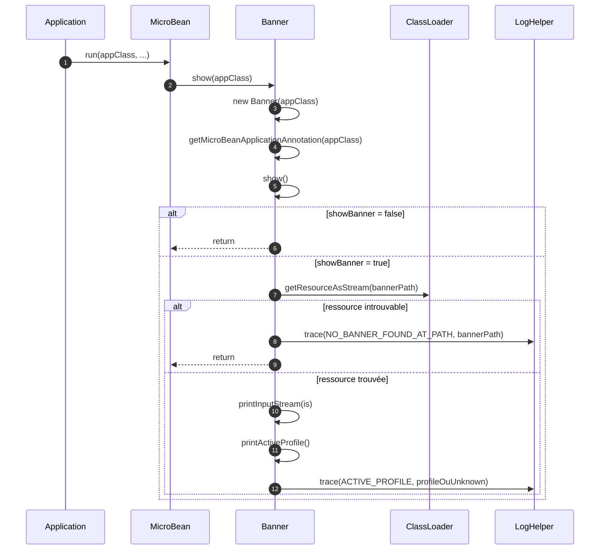
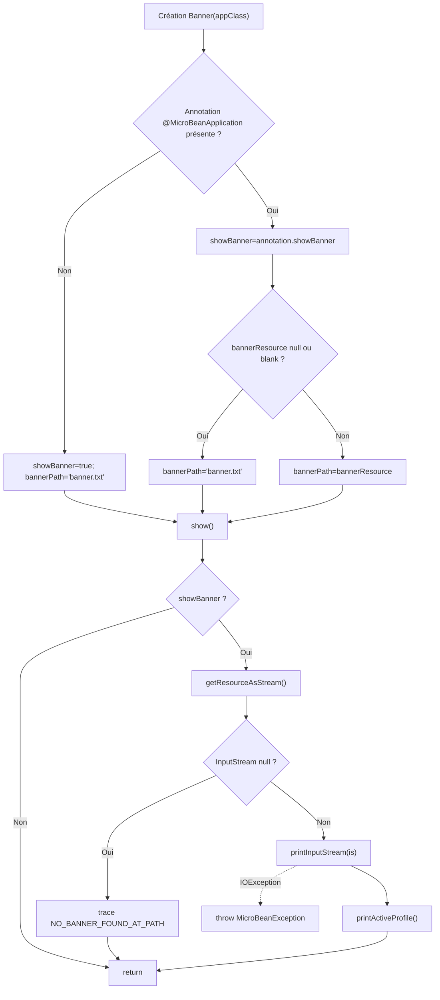

# 🖼️ Banner (infrastructure.run)

> 📘 Documentation technique orientée maintenance et évolution.

## 1) 🧭 Vue d’ensemble

`Banner` est la classe chargée de l’affichage de la bannière de démarrage du framework MicroBean.
Elle détermine d’abord **si** la bannière doit être affichée, puis **quelle ressource** doit être utilisée.

Responsabilités principales :

- ✅ lire la configuration `@MicroBeanApplication` de la classe application ;
- 🔎 résoudre le chemin de bannière (`banner.txt` par défaut ou ressource personnalisée) ;
- 🖨️ afficher le contenu de la bannière sur la sortie standard ;
- 🏷️ afficher la ligne du profil actif (`app.profile`) ;
- ⚠️ tracer proprement le cas « bannière introuvable » ;
- 🛡️ encapsuler les erreurs de lecture (`IOException`) en `MicroBeanException`.

Fichier source : `src/main/java/com/jasonpercus/microbean/infrastructure/run/Banner.java`

---

## 2) 🔗 Positionnement dans le flux MicroBean

`Banner` est invoquée au tout début du bootstrap, via `MicroBean.run(...)` :

1. `Banner.show(appClass)`
2. `Initializer.init(...)`
3. `Processor.execute(...)`
4. `AppExecutor.loadAndExecuteEntryPointServices(...)`

Autrement dit, `Banner` intervient **avant** l’initialisation IoC complète. Son rôle est purement d’observabilité startup (affichage/trace), sans construction de beans.

Référence d’orchestration : `src/main/java/com/jasonpercus/microbean/MicroBean.java`

### 🧵 Diagramme de séquence (vue d’ensemble)

---

## 3) 💡 Idée fonctionnelle : à quoi répond cette classe

`Banner` répond au besoin de **feedback visuel immédiat** au démarrage :

- confirmer que l’application démarre ;
- afficher des métadonnées utiles (nom/version, etc.) ;
- afficher le profil actif résolu.

Elle prend aussi en charge les cas de robustesse :

- bannière désactivée (`showBanner=false`) ;
- ressource absente ;
- profil non défini ou vide (`[unknown]`) ;
- échec de lecture du flux.

Sans cette classe, l’expérience de démarrage serait moins lisible et le diagnostic de configuration plus difficile.

---

## 4) 🧠 Comportement méthode par méthode

### `public Banner(Class<?> appClass)`

- Lit `@MicroBeanApplication` sur la classe application.
- Si annotation absente :
  - `showBanner = true`
  - `bannerPath = "banner.txt"`
- Si annotation présente :
  - `showBanner = annotation.showBanner()`
  - `bannerPath = annotation.bannerResource()` sauf si `null`/blank -> fallback `"banner.txt"`.

### `public void show()`

- Retour immédiat si `showBanner=false`.
- Ouvre un flux sur la ressource via `getResourceAsStream()`.
- Si flux `null` : trace `NO_BANNER_FOUND_AT_PATH` puis retour.
- Sinon :
  - `printInputStream(is)`
  - `printActiveProfile()`
- Si erreur de lecture (`IOException`) : lève `new MicroBeanException(e)`.

### `public static void show(Class<?> appClass)`

- Méthode utilitaire de façade.
- Équivalent à `new Banner(appClass).show()`.

### `MicroBeanApplication getMicroBeanApplicationAnnotation(Class<?> appClass)`

- Retourne l’annotation `@MicroBeanApplication` ou `null`.
- Visibilité package utilisée pour faciliter des tests ciblés (overrides en test).

### `InputStream getResourceAsStream()`

- Ouvre la ressource `bannerPath` depuis le classpath de `MicroBean`.
- Visibilité package utilisée pour faciliter des tests d’erreur de lecture.

### `void printInputStream(InputStream is)`

- Lit le flux en UTF-8 (`StandardCharsets.UTF_8`) et trace le contenu.

### `static void printActiveProfile()`

- Lit le profil via `MicroBean.getActiveProfile()`.
- Si profil `null` ou blank : affiche `[unknown]`.
- Sinon : affiche la valeur du profil.

### 🌊 Diagramme de flux (résolution + affichage)

---

## 5) 📐 Contrats implicites importants (pour la maintenance)

- `bannerPath` doit toujours être résolu (jamais vide après construction).
- Le fallback sur `banner.txt` est critique pour la robustesse startup.
- `show()` ne doit pas échouer si la ressource est absente (trace + retour).
- Les erreurs de lecture doivent rester encapsulées en `MicroBeanException`.
- Le profil affiché doit rester `[unknown]` si `app.profile` est absent ou blank.
- Les méthodes package-private (`getMicroBeanApplicationAnnotation`, `getResourceAsStream`) servent la testabilité ; les retirer casserait une partie de la couverture actuelle.

---

## 6) ⚠️ Risques lors des modifications

Si vous modifiez `Banner`, vérifier en priorité :

1. **Fallback ressource** : ne pas perdre le comportement `banner.txt` par défaut.
2. **Tolérance ressource absente** : conserver la trace sans exception bloquante.
3. **Gestion profil** : garder la règle `null/blank -> [unknown]`.
4. **Encapsulation des I/O** : conserver `MicroBeanException` comme exception publique.
5. **Testabilité** : attention aux méthodes package-private utilisées par les tests.

> 🛡️ Recommandation : sur toute évolution, rejouer au minimum les tests unitaires `BannerTest` et les scénarios Cucumber `banner.feature`.

---

## 7) 🧪 Tests existants sur `Banner`

### 7.1 ✅ Tests unitaires

Fichier : `src/test/java/com/jasonpercus/microbean/infrastructure/run/BannerTest.java`

Couverture actuelle :

- constructeur sans annotation -> valeurs par défaut ;
- constructeur avec ressource personnalisée ;
- constructeur avec `bannerResource` vide -> fallback ;
- constructeur avec `bannerResource` simulé à `null` -> fallback ;
- `show()` quand bannière désactivée ;
- `show()` ressource introuvable ;
- `show()` avec profil absent (`[unknown]`) ;
- `show()` avec profil blanc (`[unknown]`) ;
- `show()` avec profil défini ;
- `show()` lève `MicroBeanException` quand une `IOException` survient.

### 7.2 🥒 Tests Cucumber (intégration comportementale)

Fichiers :

- `src/test/resources/com/jasonpercus/microbean/cucumber/banner.feature`
- `src/test/java/com/jasonpercus/microbean/cucumber/steps/MicroBeanStepdefinitions.java`

Scénarios couverts :

1. affichage d’une bannière personnalisée ;
2. bannière désactivée ;
3. bannière introuvable ;
4. profil inconnu sans `app.profile` ;
5. profil inconnu avec `app.profile` blanc.

Ces scénarios valident le comportement observable de `Banner` en exécution réelle (sortie console et messages tracés).

---

## 8) 🧰 Ce qu’un mainteneur doit retenir

- `Banner` est courte mais critique pour l’expérience de démarrage.
- Son contrat principal est la robustesse d’affichage, même en cas de configuration partielle.
- Le fallback `banner.txt` et la règle `[unknown]` du profil sont des comportements métier visibles.
- Les adaptations récentes pour la testabilité (méthodes package-private) sont intentionnelles.
- Toute évolution doit préserver la compatibilité de sortie attendue par les tests unitaires/Cucumber.

---

## 9) 🗺️ Légende visuelle rapide

- ✅ Validation / précondition
- 🔎 Analyse / résolution
- 🖨️ Affichage / trace
- ⚠️ Point de vigilance
- 🧪 Couverture de tests
- 🛡️ Recommandation de fiabilité
