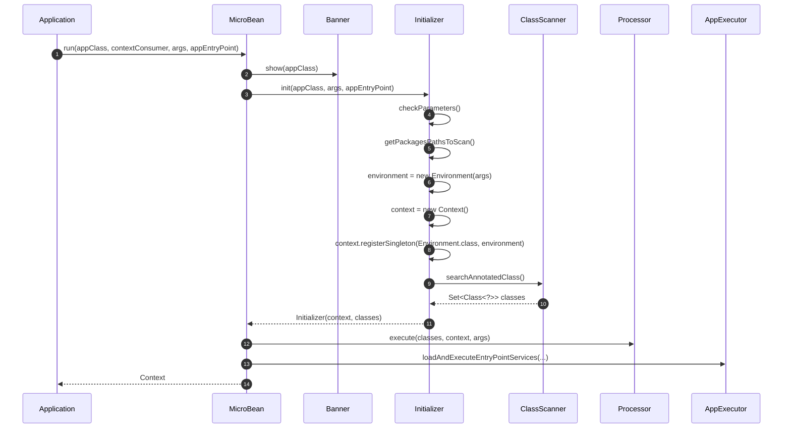
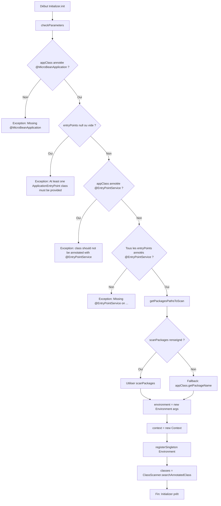

# ⚙️ Initializer (infrastructure.run)

> 📘 Documentation technique orientée maintenance et évolution.

## 1) 🧭 Vue d'ensemble

`Initializer` est une classe de **bootstrap technique** du framework MicroBean.
Son rôle est de préparer le démarrage avant le traitement IoC complet :

- ✅ vérifier que les entrées de démarrage sont cohérentes ;
- 🔎 déterminer les packages à scanner ;
- 🧱 créer un `Context` runtime ;
- 🌍 créer l'objet `Environment` à partir des arguments ;
- 📌 enregistrer `Environment` en singleton injectable ;
- 🛰️ lancer le scan des classes annotées candidates.

En pratique, cette classe répond au besoin suivant : **sécuriser et standardiser la phase d'initialisation** pour éviter de continuer l'exécution avec une configuration invalide.

Fichier source : `src/main/java/com/jasonpercus/microbean/infrastructure/run/Initializer.java`

---

## 2) 🔗 Positionnement dans le flux MicroBean

`Initializer` est appelée depuis `MicroBean.run(...)` :

1. `Banner.show(appClass)`
2. `Initializer.init(appClass, args, appEntryPoint)`
3. `Processor.execute(initializer.getClasses(), context, args)`
4. `AppExecutor.loadAndExecuteEntryPointServices(...)`

Donc `Initializer` est la **porte de validation + discovery** avant la création/assemblage des beans.

Référence : `src/main/java/com/jasonpercus/microbean/MicroBean.java`

### 🧵 Diagramme de séquence (vue d'ensemble)

---

## 3) 💡 Idée fonctionnelle : à quoi répond cette classe

`Initializer` traite deux problèmes majeurs du démarrage :

- **Qualité d'entrée** : classe principale mal annotée, entry points absents ou invalides.
- **Préparation du terrain** : connaître quoi scanner et produire les données de base (`Context` + classes candidates).

Sans cette étape, le framework pourrait échouer plus tard, avec des erreurs moins explicites et plus coûteuses à diagnostiquer.

---

## 4) 🧠 Comportement méthode par méthode

### `public static Initializer init(Class<?> appClass, String[] args, Class<? extends ApplicationEntryPoint>[] appEntryPoint)`

- Fabrique + exécute un `Initializer`.
- Enchaîne la méthode d'instance `init()`.
- Retourne l'objet initialisé, dont `context` et `classes` sont ensuite consommés par `MicroBean`.

### `void init()`

Séquence interne :

1. `checkParameters()`
2. `getPackagesPathsToScan()`
3. `environment = new Environment(args)`
4. `context = new Context()`
5. `context.registerSingleton(Environment.class, environment)`
6. `classes = new ClassScanner(packages, args).searchAnnotatedClass()`

### `void checkParameters()`

Valide les préconditions métier ; lève des `MicroBeanException` via `ExceptionManager` si besoin :

- classe principale sans `@MicroBeanApplication` ;
- aucun entry point fourni (`null` ou vide) ;
- classe principale annotée `@EntryPointService` (interdit) ;
- entry point non annoté `@EntryPointService`.

### `String[] getPackagesPathsToScan()`

- Si `@MicroBeanApplication(scanPackages=...)` est renseigné : retourne ces packages.
- Sinon : fallback sur `appClass.getPackageName()`.

### `static boolean isNotEmptyEntryPoints(...)`

- Retourne `true` si le tableau est `null` ou vide.
- Sert de garde-fou central pour la validation des entry points.

### Getters `getContext()` / `getClasses()`

Exposent les résultats produits par l'initialisation pour les étapes suivantes (`Processor`, `AppExecutor`).

### 🌊 Diagramme de flux (validations + fallback)

---

## 5) 📐 Contrats implicites importants (pour la maintenance)

- L'ordre des validations de `checkParameters()` est significatif :
  - on signale d'abord l'absence de `@MicroBeanApplication`,
  - puis l'absence d'entry points,
  - puis la cohérence des annotations `@EntryPointService`.
- `getPackagesPathsToScan()` suppose que `appClass` est déjà validée (annotation présente).
- Le scan repose sur `ClassScanner` et les annotations composants reconnues par le framework.
- `Environment` est toujours préenregistré en singleton avant le scan, donc injectable immédiatement dans les beans.
- Les messages d'erreur sont centralisés dans `Constants` + `ExceptionManager` (stabilité attendue pour les tests et l'expérience développeur).

---

## 6) ⚠️ Risques lors des modifications

Si vous modifiez `Initializer`, vérifier en priorité :

1. **Régressions de validation** : ne pas relâcher les contrôles fail-fast.
2. **Ordre des erreurs** : il impacte les messages observés par les tests Cucumber.
3. **Stratégie de scan** : un mauvais fallback de package peut vider `classes`.
4. **Singleton runtime** : ne pas casser l'enregistrement de `Environment` dans `Context`.
5. **Compatibilité d'API** : `MicroBean.run(...)` dépend de `getContext()` et `getClasses()`.

> 🛡️ Recommandation : conserver des changements atomiques et relancer unitaires + Cucumber.

---

## 7) 🧪 Tests existants sur `Initializer`

### 7.1 ✅ Tests unitaires

Fichier : `src/test/java/com/jasonpercus/microbean/infrastructure/run/InitializerTest.java`

Ces tests couvrent :

- **Nominal**
  - initialisation du `Context` ;
  - production d'un `Set<Class<?>>` non nul.

- **Erreurs de validation**
  - classe app sans `@MicroBeanApplication` ;
  - tableau `entryPoints` à `null` ;
  - tableau `entryPoints` vide ;
  - classe principale annotée `@EntryPointService` ;
  - entry point non annoté `@EntryPointService`.

- **Packages à scanner**
  - retour des `scanPackages` explicites ;
  - fallback sur le package de la classe application.

- **Méthode utilitaire**
  - `isNotEmptyEntryPoints(...)` pour les cas `null`, vide, et non vide.

Objectif de ces tests : verrouiller la logique locale de `Initializer` sans dépendre du flux complet du framework.

### 7.2 🥒 Tests Cucumber (intégration comportementale)

Fichiers :
- `src/test/resources/com/jasonpercus/microbean/cucumber/microbean.feature`
- `src/test/java/com/jasonpercus/microbean/cucumber/steps/MicroBeanStepdefinitions.java`

Scénarios directement liés à `Initializer` :

1. Absence de `@MicroBeanApplication` -> exception attendue.
2. Aucun entry point défini -> exception attendue.
3. Classe principale aussi annotée `@EntryPointService` -> exception attendue.
4. Entry point non annoté `@EntryPointService` -> exception attendue.

Ce que ces scénarios apportent en plus des unitaires :

- vérification **bout en bout** via `MicroBean.run(...)` ;
- vérification des messages d'erreur dans le contexte réel d'exécution ;
- garantie que la validation `Initializer` reste cohérente avec l'orchestration globale.

---

## 8) 🧰 Ce qu'un mainteneur doit retenir

- `Initializer` est une classe courte mais critique : elle protège le framework des démarrages invalides.
- Son output (`Context` + classes scannées) conditionne toutes les étapes aval.
- Avant toute évolution, vérifier l'impact sur :
  - les préconditions de démarrage,
  - le calcul des packages à scanner,
  - les messages d'erreur attendus par les tests.

En cas de refactor, commencer par ajuster/étendre les tests dans `InitializerTest` puis confirmer avec les scénarios Cucumber de `microbean.feature`.

---

## 9) 🗺️ Légende visuelle rapide

- ✅ Validation / précondition
- 🔎 Analyse / scan
- ⚠️ Point de vigilance
- 🧪 Couverture de tests
- 🛡️ Recommandation de fiabilité
