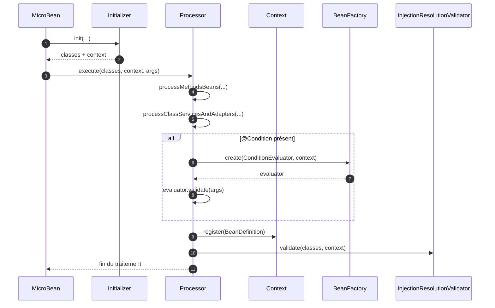
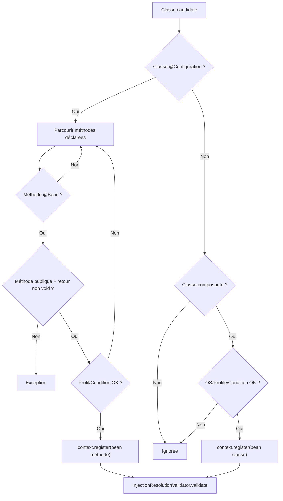

# ⚙️ Processor (infrastructure.run)

> 📘 Documentation technique orientée maintenance et évolution.

## 1) 🧭 Vue d'ensemble

`Processor` est le **cœur d'orchestration IoC** après l'initialisation.
Elle prend les classes détectées par le scanner et décide, pour chacune, si elle doit être enregistrée dans le `Context`.

Responsabilités principales :

- ✅ traiter les classes `@Configuration` et leurs méthodes `@Bean` ;
- ✅ traiter les classes composantes (`@Service`, `@Adapter`) ;
- 🔎 appliquer les filtres métier (`@Profile`, `@Condition`, OS) ;
- 🧪 déclencher la validation finale de résolvabilité des injections ;
- ⚠️ encapsuler les erreurs de traitement de configuration et d'évaluation de condition.

Fichier source : `src/main/java/com/jasonpercus/microbean/infrastructure/run/Processor.java`

---

## 2) 🔗 Positionnement dans le flux MicroBean

`Processor` intervient après `Initializer` et avant `AppExecutor` :

1. `Banner.show(appClass)`
2. `Initializer.init(appClass, args, appEntryPoint)`
3. `Processor.execute(initializer.getClasses(), context, args)`
4. `AppExecutor.loadAndExecuteEntryPointServices(...)`

`Processor` est donc la phase qui transforme les classes candidates en **définitions de beans effectivement enregistrées**.

Référence d'orchestration : `src/main/java/com/jasonpercus/microbean/MicroBean.java`

### 🧵 Diagramme de séquence (vue d'ensemble)

---

## 3) 💡 Idée fonctionnelle : à quoi répond cette classe

`Processor` répond à la question :
**« Parmi toutes les classes scannées, lesquelles doivent réellement devenir des beans actifs ? »**

Elle applique des règles de filtrage cohérentes et déterministes :

- profil actif (`@Profile`) ;
- condition dynamique (`@Condition` + `ConditionEvaluator`) ;
- compatibilité système pour les adaptateurs (`@Adapter(os=...)`).

Sans cette classe, le framework enregistrerait soit trop de composants (risque d'ambiguïtés), soit pas assez (risque d'injection introuvable).

---

## 4) 🧠 Comportement méthode par méthode

### `public static void execute(Set<Class<?>> classes, Context context, String[] args)`

- Point d'entrée principal.
- Exécute successivement :
  1. traitement des méthodes `@Bean` ;
  2. traitement des classes composantes ;
  3. validation de la résolvabilité des injections.

### `processMethodsBeans(...)`

- Filtre les classes `@Configuration`.
- Pour chacune : instanciation + analyse des méthodes déclarées.

### `analyseConfigClass(...)`

- Crée l'instance de configuration via constructeur sans argument.
- Parcourt toutes les méthodes déclarées.
- En cas d'erreur : encapsule via `ExceptionManager.analyseConfigurationClassFailed(...)`.

### `analyseConfigMethod(...)`

- Ignore les méthodes non `@Bean`.
- Échec immédiat si méthode `@Bean` non publique.
- Échec immédiat si méthode `@Bean` retourne `void`.
- Vérifie ensuite les filtres `@Profile` / `@Condition`.
- Si valide : enregistre un `BeanDefinition` basé sur la méthode.

### `processClassServicesAndAdapters(...)` + `analyseClass(...)`

- Parcourt toutes les classes candidates.
- Ignore celles qui ne sont pas des composants (`@Service`, `@Adapter`, `@EntryPointService`).
- Applique les filtres OS / profil / condition.
- Si valide : enregistre un `BeanDefinition` basé sur la classe.

### `shouldNotRegister...(...)`

- `shouldNotRegister(Class<?> configClass, Method method, ...)` : filtre pour bean de méthode.
- `shouldNotRegister(Class<?> clazz, ...)` : filtre pour composant de classe.
- `shouldNotRegisterOperatingSystem(...)` : spécifique aux `@Adapter`.
- `shouldNotRegisterProfile(...)` : évalue `ProfileValidator.invalidate()`.
- `shouldNotRegisterCondition(...)` : évalue `condition.negate() == evaluate(...)`.

### `evaluate(Condition condition, Context context, String[] args)`

- Instancie le `ConditionEvaluator` via `BeanFactory.create(...)`.
- Exécute `validate(args)`.
- En cas d'erreur : encapsule via `ExceptionManager.failedToEvaluateCondition(...)`.

### `returnTypeMethodIsVoid(...)` et `showMessageProfileSkipped(...)`

- Helpers internes de lisibilité/traçabilité.

### 🌊 Diagramme de flux (décision d'enregistrement)

---

## 5) 📐 Contrats implicites importants (pour la maintenance)

- `@Bean` doit rester **publique** et **non void**.
- La logique `condition.negate() == evaluate(...)` définit explicitement le "skip".
- L'ordre de filtrage est significatif : profil avant condition pour les méthodes, OS/profil/condition pour les classes.
- Les exceptions sont volontairement centralisées via `ExceptionManager` pour stabiliser les messages.
- La validation finale `InjectionResolutionValidator.validate(...)` fait partie du contrat de `execute(...)`.

---

## 6) ⚠️ Risques lors des modifications

1. **Inversion de logique conditionnelle** : modifier `negate` peut inverser tous les cas Cucumber/Unit.
2. **Ordre des filtres** : changer la priorité peut produire des régressions discrètes.
3. **Messages d'erreur** : les tests reposent sur des fragments de messages constants.
4. **Instanciation de configuration** : nécessite un constructeur sans argument.
5. **Validation finale** : la supprimer masquerait des injections non résolubles.

> 🛡️ Recommandation : toute évolution sur `Processor` doit être validée par les tests unitaires **et** les scénarios Cucumber dédiés.

---

## 7) 🧪 Tests existants sur `Processor`

### 7.1 ✅ Tests unitaires

Fichier : `src/test/java/com/jasonpercus/microbean/infrastructure/run/ProcessorTest.java`

Couverture actuelle (principale) :

- nominal : enregistrement bean de configuration + service ;
- méthode non `@Bean` ignorée ;
- erreur méthode `@Bean` non publique ;
- erreur méthode `@Bean` retour `void` ;
- filtrage profil (méthode invalide + valide) ;
- filtrage profil (classe invalide + valide) ;
- filtrage OS adaptateur (incompatible + compatible) ;
- filtrage condition méthode (valide + negate) ;
- filtrage condition classe (skip + keep) ;
- erreur d'évaluation de condition.

### 7.2 🥒 Tests Cucumber

Fichier : `src/test/resources/com/jasonpercus/microbean/cucumber/processor.feature`

Scénarios couverts :

1. enregistrement nominal des composants ;
2. skip d'un service par profil ;
3. enregistrement d'un adaptateur avec OS compatible ;
4. skip d'un bean de configuration avec condition negate ;
5. erreur sur méthode `@Bean` non publique.

Steps associées : `src/test/java/com/jasonpercus/microbean/cucumber/steps/MicroBeanStepdefinitions.java`

Ces scénarios valident le comportement de `Processor` en mode BDD, lisible côté métier.

---

## 8) 🧰 Ce qu'un mainteneur doit retenir

- `Processor` est le moteur de décision d'enregistrement des beans.
- Les trois filtres clés sont : **profil**, **condition**, **OS**.
- La formule de condition avec `negate` est un point sensible.
- `execute(...)` ne s'arrête pas à l'enregistrement : il inclut la validation de résolvabilité.
- Avant refactor, verrouiller d'abord les tests `ProcessorTest` + `processor.feature`.

---

## 9) 🗺️ Légende visuelle rapide

- ✅ Validation / précondition
- 🔎 Analyse / décision
- ⚠️ Point de vigilance
- 🧪 Couverture de tests
- 🛡️ Recommandation de fiabilité

