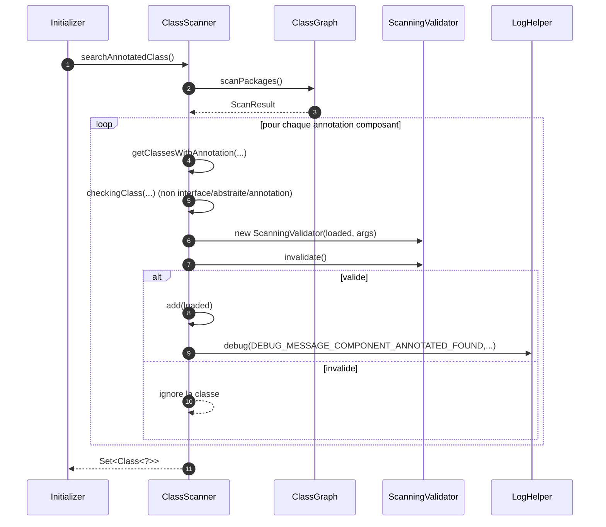
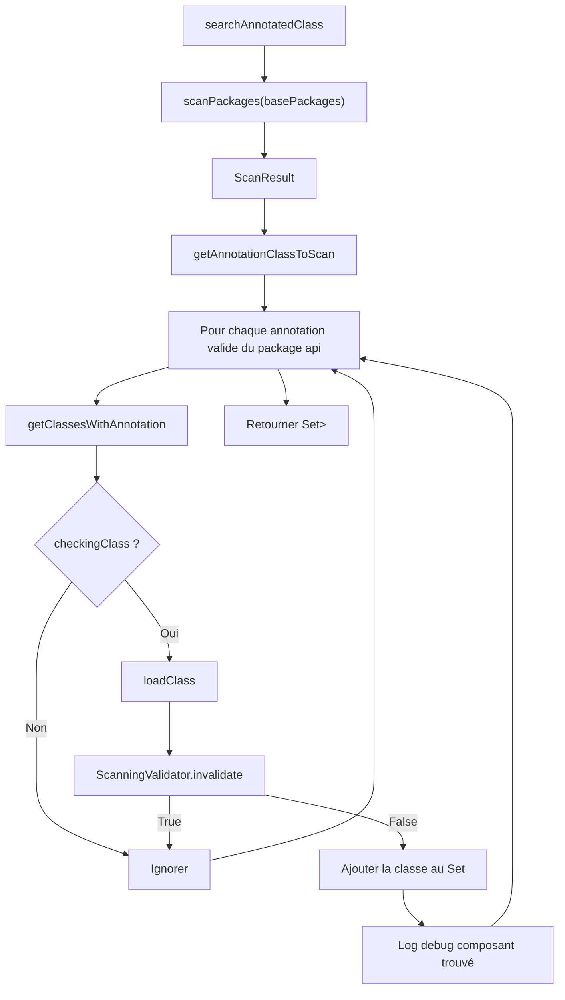

# 🔎 ClassScanner (infrastructure.scanner)

> 📘 Documentation technique orientée maintenance et évolution.

## 1) 🧭 Vue d’ensemble

`ClassScanner` est responsable du **scan des classes annotées** dans les packages applicatifs.
Il sert de passerelle entre la découverte technique (ClassGraph) et les règles métier de sélection des composants.

Responsabilités principales :

- 🧱 lancer un scan des packages déclarés ;
- 🏷️ cibler uniquement les annotations composants supportées ;
- 🚫 exclure les interfaces, classes abstraites et annotations ;
- ✅ appliquer une validation métier via `ScanningValidator` ;
- 🐞 tracer en debug les composants retenus.

En pratique, cette classe répond au besoin suivant : **fournir la liste finale des classes candidates à l’injection/traitement** tout en filtrant les faux positifs.

Fichier source : `src/main/java/com/jasonpercus/microbean/infrastructure/scanner/ClassScanner.java`

---

## 2) 🔗 Positionnement dans le flux MicroBean

`ClassScanner` est utilisée pendant l’initialisation du runtime, via `Initializer` :

1. `Initializer.getPackagesPathsToScan()`
2. `new ClassScanner(packages, args).searchAnnotatedClass()`
3. classes retenues transmises à `Processor.execute(...)`

Elle intervient donc entre la configuration de démarrage et le traitement IoC.

Références :

- `src/main/java/com/jasonpercus/microbean/infrastructure/run/Initializer.java`
- `src/main/java/com/jasonpercus/microbean/infrastructure/run/Processor.java`

### 🧵 Diagramme de séquence (vue d’ensemble)

---

## 3) 💡 Idée fonctionnelle : à quoi répond cette classe

`ClassScanner` traite deux problèmes essentiels.

- **Découverte technique** : retrouver toutes les classes portant des annotations composants.
- **Sélection utile** : ne conserver que les classes réellement exploitables et autorisées par les règles métier.

Sans cette étape, le framework risquerait :

- d’essayer d’instancier des interfaces/abstraites,
- d’inclure des classes non compatibles avec le contexte (profil/condition/OS),
- et de polluer le pipeline de traitement aval.

---

## 4) 🧠 Comportement méthode par méthode

### `public Set<Class<?>> searchAnnotatedClass()`

- Point d’entrée principal.
- Crée un ensemble de sortie (`LinkedHashSet`).
- Ouvre `ScanResult` via try-with-resources.
- Délègue le filtrage à `filterScannedClass(...)`.
- Retourne l’ensemble final des classes retenues.

### `private ScanResult scanPackages(String[] packages)`

- Configure et exécute ClassGraph :
  - `enableClassInfo()`
  - `enableAnnotationInfo()`
  - `acceptPackages(packages)`
- Retourne le résultat brut du scan.

### `private List<? extends Class<? extends Annotation>> getAnnotationClassToScan()`

- Scanne le package `com.jasonpercus.microbean.api`.
- Conserve uniquement les annotations :
  - avec `@Retention(RUNTIME)`,
  - ciblant `ElementType.TYPE`.
- Exclut explicitement `@Condition`, `@MicroBeanApplication`, `@Primary`, `@Profile`.

### `private void filterScannedClass(ScanResult scanResult, Set<Class<?>> classes)`

- Parcourt les annotations retournées par `getAnnotationClassToScan()`.
- Pour chaque annotation :
  - récupère les classes annotées,
  - applique `checkingClass(...)`,
  - appelle `analyseAndPushAnnotatedClass(...)`.

### `private void analyseAndPushAnnotatedClass(...)`

- Charge la classe (`classInfo.loadClass()`).
- Instancie `ScanningValidator` avec `args`.
- Si `validator.invalidate()` vaut `true` : ignore la classe.
- Sinon : ajoute la classe au résultat et log en debug.

### `private static boolean filterRetentionAndTarget(Class<? extends Annotation> annotation)`

- Vérifie que l’annotation est conservée en `RetentionPolicy.RUNTIME`.
- Vérifie que `@Target` contient `ElementType.TYPE`.
- Retourne `false` si `@Retention` est absente / non runtime, ou si `@Target` est absent / incompatible.

### `private static boolean checkingClass(ClassInfo classInfo)`

- Vérifie que la classe n’est :
  - ni interface,
  - ni abstraite,
  - ni annotation.

### `private static boolean isNotInterface(...)`, `isNotAbstract(...)`, `isNotAnnotation(...)`

- Helpers de lisibilité pour les filtres techniques.

### 🌊 Diagramme de flux (filtrage complet)

---

## 5) 📐 Contrats implicites importants (pour la maintenance)

- Les annotations scannées sont découvertes dynamiquement dans le package `api`.
- Seules les annotations `RUNTIME` ciblant `TYPE` sont retenues.
- `@Condition`, `@MicroBeanApplication`, `@Primary` et `@Profile` sont volontairement exclues de la détection composant.
- Le filtrage technique (`checkingClass`) est appliqué **avant** la validation métier.
- Une classe invalidée par `ScanningValidator` ne doit jamais être ajoutée au résultat.
- Le résultat est un `Set` : absence de doublons attendue.
- Le log debug doit uniquement concerner les classes effectivement retenues.

---

## 6) ⚠️ Risques lors des modifications

Si vous modifiez `ClassScanner`, vérifier en priorité :

1. **Ordre des filtres** : ne pas inverser filtre technique et validation métier.
2. **Découverte des annotations** : tout changement sur `getAnnotationClassToScan(...)` ou `filterRetentionAndTarget(...)` impacte la découverte.
3. **Performance** : le scan de packages larges peut coûter cher.
4. **Traçage debug** : garder des logs fidèles aux classes réellement retenues.
5. **Compatibilité aval** : `Processor` dépend de la qualité de la liste renvoyée.

> 🛡️ Recommandation : toute évolution de cette classe doit être validée en unitaire (`ClassScannerTest`) et en Cucumber (`classscanner.feature`).

---

## 7) 🧪 Tests existants sur `ClassScanner`

### 7.1 ✅ Tests unitaires

Fichier : `src/test/java/com/jasonpercus/microbean/infrastructure/scanner/ClassScannerTest.java`

Cas couverts :

- scan nominal des classes annotées valides (`Service`, `Adapter`, `Configuration`, `EntryPointService`) ;
- exclusion des interfaces, classes abstraites et annotations ;
- résultat vide si aucun composant annoté ;
- exclusion d’une classe annotée invalidée par `ScanningValidator.invalidate() == true` ;
- couverture complète de `filterRetentionAndTarget(...)` :
  - retention absente,
  - retention non runtime,
  - target absent,
  - target sans `TYPE`,
  - target incluant `TYPE`.

Fixtures utilisées :

- `src/test/java/com/jasonpercus/microbean/infrastructure/scanner/fixtures/valid/...`
- `src/test/java/com/jasonpercus/microbean/infrastructure/scanner/fixtures/excluded/...`
- `src/test/java/com/jasonpercus/microbean/infrastructure/scanner/fixtures/empty/...`
- `src/test/java/com/jasonpercus/microbean/infrastructure/scanner/fixtures/invalidated/...`

### 7.2 🥒 Tests Cucumber (intégration comportementale)

Feature dédiée :

- `src/test/resources/com/jasonpercus/microbean/cucumber/classscanner.feature`

Scénarios couverts :

1. scan nominal des composants annotés valides ;
2. exclusion des interfaces/abstraites/annotations ;
3. exclusion d’une classe invalidée par `ScanningValidator`.

Ces scénarios valident le comportement observable du scan dans un contexte d’exécution réel (sorties structurées `SCANNED:*`).

Feature globale liée au flux complet :

- `src/test/resources/com/jasonpercus/microbean/cucumber/microbean.feature`

Elle confirme indirectement que le scan alimente correctement le pipeline nominal complet.

---

## 8) 🧰 Ce qu’un mainteneur doit retenir

- `ClassScanner` est la porte d’entrée de la découverte des composants.
- Deux filtres s’enchaînent : technique puis métier.
- Le résultat doit rester propre (classes concrètes, autorisées, sans doublon).
- La moindre régression ici impacte fortement `Processor` et le démarrage global.
- Les tests actuels couvrent à la fois le détail local et l’intégration comportementale.

---

## 9) 🗺️ Légende visuelle rapide

- ✅ Validation / précondition
- 🔎 Analyse / scan
- ⚠️ Point de vigilance
- 🧪 Couverture de tests
- 🛡️ Recommandation de fiabilité
