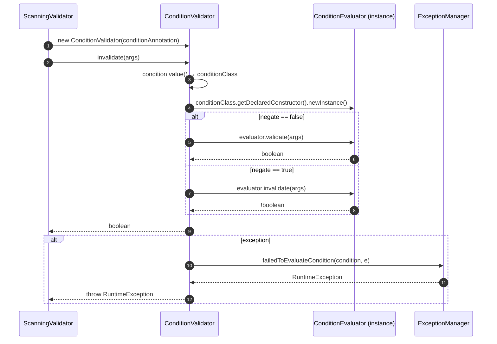
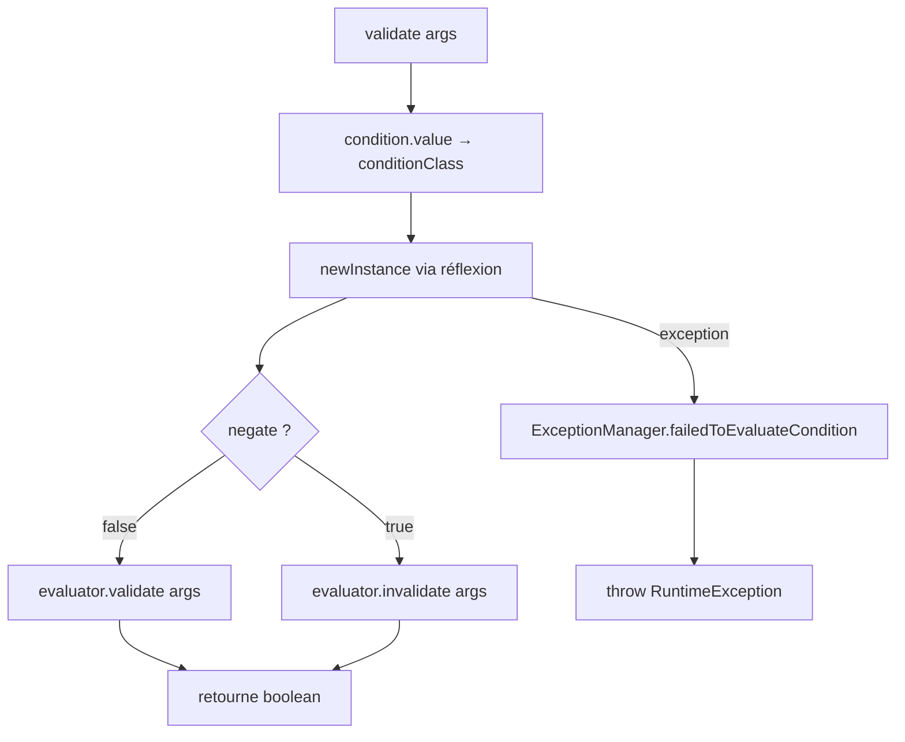

# ⚙️ ConditionValidator (infrastructure.validator)

> 📘 Documentation technique orientée maintenance et évolution.

## 1) 🧭 Vue d'ensemble

`ConditionValidator` est l'**implémentation de `Validator<String[]>`** chargée d'évaluer une annotation `@Condition` portée par un composant MicroBean.

Son rôle est de décider dynamiquement si un composant doit être activé selon la logique personnalisée d'un `ConditionEvaluator`.

Ses responsabilités principales sont les suivantes :

- 🔎 récupérer la classe d'évaluateur déclarée dans `@Condition#value()` ;
- 🏗️ instancier cet évaluateur dynamiquement via réflexion ;
- ✅ déléguer l'évaluation à `ConditionEvaluator#validate(String[])` ;
- 🔁 inverser le résultat via `ConditionEvaluator#invalidate(String[])` si `@Condition#negate()` est `true` ;
- 💥 lever une `RuntimeException` enrichie si l'instanciation ou l'évaluation échoue.

Fichier source : `src/main/java/com/jasonpercus/microbean/infrastructure/validator/ConditionValidator.java`

---

## 2) 🔗 Positionnement dans le flux applicatif

`ConditionValidator` est utilisé lors du **scan des composants**, juste après la vérification du profil actif et avant l'enregistrement du composant dans le contexte.

Le flux réel observé est :

1. `ScanningValidator` détecte la présence de `@Condition` sur une classe.
2. `ScanningValidator` crée un `ConditionValidator` avec l'annotation récupérée.
3. `ConditionValidator.validate(args)` ou `invalidate(args)` est appelé.
4. `ConditionValidator` instancie dynamiquement le `ConditionEvaluator` déclaré.
5. L'évaluateur est appelé avec les `args` applicatifs.
6. Si `negate=true`, le résultat est inversé.
7. En cas d'échec technique, `ExceptionManager.failedToEvaluateCondition(...)` est appelé.

Références principales :

- `src/main/java/com/jasonpercus/microbean/infrastructure/validator/ScanningValidator.java`
- `src/main/java/com/jasonpercus/microbean/api/Condition.java`
- `src/main/java/com/jasonpercus/microbean/api/ConditionEvaluator.java`
- `src/main/java/com/jasonpercus/microbean/infrastructure/exception/ExceptionManager.java`

### 🧵 Diagramme de séquence

---

## 3) 💡 Idée fonctionnelle : à quoi répond cette classe

`ConditionValidator` répond au besoin d'**activation conditionnelle personnalisée** des composants MicroBean.

`@Profile` permet une activation par environnement. `@Condition` va plus loin : elle permet d'**externaliser n'importe quelle logique de décision** dans une classe dédiée `ConditionEvaluator`.

`ConditionValidator` est le pont entre l'annotation portée sur le composant et l'évaluateur fourni par l'application. Il garantit :

- que la décision est bien déléguée au bon évaluateur ;
- que `negate` inverse bien le résultat global ;
- que tout échec technique est converti en une exception claire et traçable.

---

## 4) 🧠 Comportement méthode par méthode

### `public ConditionValidator(Condition condition)`

- Reçoit l'annotation `@Condition` portée par la classe à valider.
- Stocke la référence pour l'utiliser lors de la validation.
- Ne réalise aucune vérification à ce stade.

### `public boolean validate(String[] args)`

Étapes internes :

1. Récupère `conditionClass` depuis `condition.value()`.
2. Instancie `conditionClass` via `getDeclaredConstructor().newInstance()`.
3. Si `condition.negate() == true` → appelle `evaluator.invalidate(args)`.
4. Sinon → appelle `evaluator.validate(args)`.
5. En cas d'exception (instanciation ou évaluation) → délègue à `ExceptionManager.failedToEvaluateCondition(condition, e)`.

#### Cas `negate = false`

| Résultat de `evaluator.validate(args)` | Résultat de `ConditionValidator.validate(args)` | Composant activé ? |
|----------------------------------------|-------------------------------------------------|--------------------|
| `true`                                 | `true`                                          | ✅ Oui              |
| `false`                                | `false`                                         | ❌ Non              |

#### Cas `negate = true`

| Résultat de `evaluator.validate(args)` | Résultat de `ConditionValidator.validate(args)` | Composant activé ? |
|----------------------------------------|-------------------------------------------------|--------------------|
| `true`                                 | `false`                                         | ❌ Non              |
| `false`                                | `true`                                          | ✅ Oui              |

### 🌊 Diagramme de flux interne de `validate(...)`

---

## 5) 📐 Contrats implicites importants (pour la maintenance)

- ✅ **L'évaluateur doit posséder un constructeur sans argument accessible** : l'instanciation repose sur `getDeclaredConstructor().newInstance()`.
- ✅ **`negate = true` inverse le résultat final**, pas la logique interne de l'évaluateur.
- ✅ **Tout échec technique est converti en `RuntimeException`** : aucune exception vérifiée ne remonte de `validate(...)`.
- ✅ **`args` peut être `null`** : l'évaluateur doit être conçu pour le tolérer.
- ✅ **`ConditionValidator` ne met pas en cache l'instance de l'évaluateur** : une nouvelle instance est créée à chaque appel de `validate(...)`.

---

## 6) ⚠️ Risques lors des modifications

Si vous modifiez `ConditionValidator`, vérifier en priorité :

1. **Instanciation réflexive** : si le `ConditionEvaluator` n'a pas de constructeur sans argument public ou package-private, l'instanciation échouera silencieusement (l'exception est capturée et convertie).
2. **Sens de `negate`** : `negate = true` sur l'annotation signifie que le composant est activé **quand** la condition échoue. Ne jamais inverser ce sens.
3. **Propagation de l'exception** : l'exception lancée via `ExceptionManager` doit rester une `RuntimeException` pour ne pas modifier la signature de `validate(...)`.
4. **Appel avec `args = null`** : les surcharges sans argument de `Validator` appellent `validate(null)` ; l'évaluateur doit supporter ce cas.

---

## 7) 🧪 Tests existants sur `ConditionValidator`

### ✅ Tests unitaires

Fichier : `src/test/java/com/jasonpercus/microbean/infrastructure/validator/ConditionValidatorTest.java`

Les tests unitaires couvrent les points suivants.

#### Échec technique de l'évaluateur

- levée d'une `MicroBeanException` lorsque le `ConditionEvaluator` ne peut pas être instancié (constructeur privé inaccessible) ;
- vérification que le message contient `"Failed to evaluate condition"`.

#### Condition satisfaite (`negate = false`)

- `validate(null)` retourne `true` quand l'évaluateur retourne `true`.

#### Condition inversée (`negate = true`)

- `validate(null)` retourne `false` quand `negate = true` et l'évaluateur retourne `true`.

#### Approche de test

Les tests utilisent des classes annotées statiques internes (`TestFailed`, `TestSuccess`, `TestNegateSuccess`) pour récupérer de vraies instances d'annotation `@Condition` via réflexion, et des `ConditionEvaluator` dédiés (`EvaluatorFailed`, `EvaluatorSuccess`).

> ℹ️ Le cas `negate = false` avec évaluateur `false` (condition non satisfaite) et le cas `negate = true` avec évaluateur `false` (condition inversée satisfaite) ne sont pas couverts par les tests unitaires directs de `ConditionValidator`, mais sont couverts indirectement via les tests de `ScanningValidator`.

---

## 8) 🧰 Ce qu'un mainteneur doit retenir

- `ConditionValidator` est un **pont de délégation** : il ne contient aucune logique métier propre, toute la décision appartient au `ConditionEvaluator`.
- Son seul rôle propre est de **gérer l'instanciation réflexive** et de **gérer le flag `negate`**.
- Il ne doit jamais mettre en cache l'évaluateur : chaque appel à `validate(...)` crée une nouvelle instance.
- En cas d'erreur technique, l'exception est toujours enrichie via `ExceptionManager` pour faciliter le diagnostic.

---

## 9) 🗺️ Légende visuelle rapide

- ✅ Validation / précondition
- 🧱 Initialisation / contexte
- 🔎 Analyse / traitement
- ⚠️ Point de vigilance
- 🧪 Couverture de tests
- 🛡️ Recommandation de fiabilité
