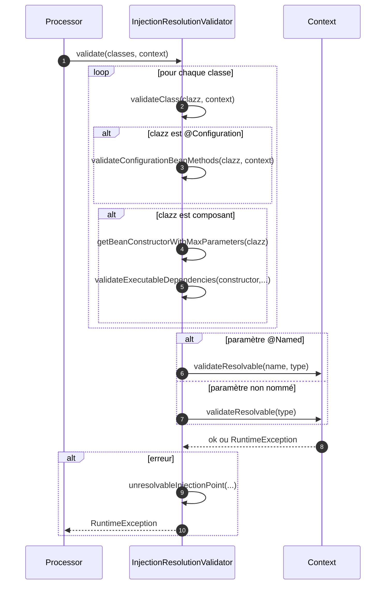
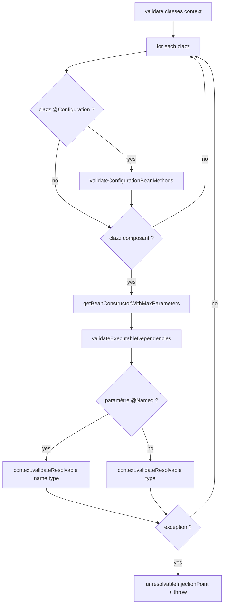

# ⚙️ InjectionResolutionValidator (infrastructure.validator)

> 📘 Documentation technique orientée maintenance et évolution.

## 1) 🧭 Vue d'ensemble

`InjectionResolutionValidator` est une **classe utilitaire statique** qui vérifie, en amont de la création des beans, que tous les points d'injection d'un ensemble de classes sont résolvables dans le `Context`.

Son rôle principal est de faire du **fail-fast** : détecter les dépendances non résolubles avant l'exécution applicative.

Responsabilités :

- 🔎 analyser les dépendances des méthodes `@Bean` des classes `@Configuration` ;
- 🧱 analyser les dépendances du constructeur principal (plus grand nombre de paramètres) des classes composant ;
- 🏷️ gérer la résolution nommée (`@Named`) et la résolution par type ;
- 💥 lever une exception enrichie si un point d'injection est non résoluble.

Fichier source : `src/main/java/com/jasonpercus/microbean/infrastructure/validator/InjectionResolutionValidator.java`

---

## 2) 🔗 Positionnement dans le flux applicatif

Cette classe est appelée pendant la phase de traitement (`Processor`) pour valider les dépendances avant l'instanciation effective des composants.

Flux simplifié :

1. `Processor` rassemble les classes détectées.
2. `InjectionResolutionValidator.validate(classes, context)` est invoqué.
3. Chaque classe est inspectée.
4. Pour chaque paramètre d'injection :
   - résolution par type (`context.validateResolvable(type)`), ou
   - résolution par nom+type (`context.validateResolvable(name, type)`).
5. En cas d'échec : exception `Unresolvable injection` contextualisée.

Références principales :

- `src/main/java/com/jasonpercus/microbean/infrastructure/run/Processor.java`
- `src/main/java/com/jasonpercus/microbean/infrastructure/factory/Context.java`
- `src/main/java/com/jasonpercus/microbean/infrastructure/helpers/AnnotationHelper.java`
- `src/main/java/com/jasonpercus/microbean/infrastructure/exception/ExceptionManager.java`

### 🧵 Diagramme de séquence

---

## 3) 💡 Idée fonctionnelle : à quoi répond cette classe

`InjectionResolutionValidator` répond au besoin suivant :

> **Garantir que toute dépendance déclarée dans les signatures d'injection est résoluble avant la création des instances.**

Sans cette étape, les erreurs d'injection apparaîtraient plus tard dans le cycle de vie, avec des diagnostics moins précis.

Cette validation apporte :

- une détection précoce des incohérences de câblage ;
- des messages d'erreur contextualisés (classe/méthode/paramètre, et nom `@Named` le cas échéant) ;
- une séparation claire entre validation des signatures et création réelle des objets.

---

## 4) 🧠 Comportement méthode par méthode

### `public static void validate(Set<Class<?>> classes, Context context)`

- Point d'entrée principal.
- Itère sur chaque classe et délègue à `validateClass`.

### `private static void validateClass(Class<?> clazz, Context context)`

- Si la classe est `@Configuration` : valide d'abord les paramètres des méthodes `@Bean`.
- Si la classe n'est pas un composant : termine immédiatement.
- Sinon : sélectionne le constructeur principal et valide ses dépendances.

### `private static void validateConfigurationBeanMethods(Class<?> configurationClass, Context context)`

- Parcourt les méthodes déclarées de la classe.
- Filtre uniquement les méthodes annotées `@Bean`.
- Valide les paramètres de chaque méthode `@Bean`.

### `private static void validateExecutableDependencies(Executable executable, Context context, String ownerLabel)`

- Parcourt tous les paramètres de l'exécutable (méthode ou constructeur).
- Si paramètre annoté `@Named` : validation par nom + type.
- Sinon : validation par type.
- En cas d'échec : encapsule via `unresolvableInjectionPoint(...)` avec description détaillée du point d'injection.

### `private static <T> Constructor<T> getBeanConstructorWithMaxParameters(Class<T> clazz)`

- Sélectionne le constructeur déclaré ayant le plus de paramètres.
- Lance `NoSuchElementException` si aucun constructeur déclaré n'est trouvé.

### `private static String describeInjectionPoint(String ownerLabel, Parameter parameter)`

- Construit un libellé lisible de type :
  - `Owner parameter 'argName'`
  - `Owner parameter 'argName' @Named("value")` si applicable.

### 🌊 Diagramme de flux interne

---

## 5) 📐 Contrats implicites importants (pour la maintenance)

- ✅ Une classe `@Configuration` est validée sur ses méthodes `@Bean` même si elle n'est pas considérée composant par `isNotComponentClass`.
- ✅ Pour les composants, le constructeur retenu est toujours celui avec le plus de paramètres.
- ✅ La résolution `@Named` a priorité sur la résolution simple par type.
- ✅ Toute erreur de résolution est encapsulée avec un message enrichi par `unresolvableInjectionPoint`.
- ✅ Le validateur ne crée aucun bean ; il valide uniquement la **résolvabilité** des signatures.

---

## 6) ⚠️ Risques lors des modifications

1. **Choix du constructeur principal** : changer la règle "max paramètres" modifie potentiellement le point d'injection validé.
2. **Ordre de validation des classes `@Configuration`** : retirer la validation des méthodes `@Bean` ferait perdre des erreurs précoces.
3. **Traitement de `@Named`** : une régression ici peut casser des injections nommées valides.
4. **Enrichissement des erreurs** : simplifier ou retirer `describeInjectionPoint` dégrade le diagnostic opérationnel.
5. **Cohérence avec `Context.validateResolvable(...)`** : toute évolution des signatures de `Context` doit être propagée ici.

---

## 7) 🧪 Tests existants sur `InjectionResolutionValidator`

### ✅ Tests unitaires

Fichier : `src/test/java/com/jasonpercus/microbean/infrastructure/validator/InjectionResolutionValidatorTest.java`

Les tests couvrent :

- réussite quand une fabrique expose une interface et que le consommateur injecte l'interface ;
- échec quand la fabrique expose une abstraction mais que le consommateur injecte un type concret ;
- réussite d'une injection nommée quand le nom existe (`paypal`) ;
- échec d'une injection nommée quand le nom est absent (`stripe`).

Garanties apportées :

- validation fail-fast de la résolvabilité des injections ;
- prise en charge correcte des cas nommés et non nommés ;
- qualité du message d'erreur (`Unresolvable injection` + type/nom attendu).

---

## 8) 🧰 Ce qu'un mainteneur doit retenir

- `InjectionResolutionValidator` est un garde-fou de câblage avant création des beans.
- Il s'appuie entièrement sur `Context` pour décider si une dépendance est résoluble.
- Le contrat de sélection du constructeur principal est structurant.
- La description de point d'injection est essentielle pour le diagnostic en production.
- Toute évolution doit être validée par les tests unitaires d'injection interface/concret et `@Named`.

---

## 9) 🗺️ Légende visuelle rapide

- ✅ Validation / précondition
- 🧱 Initialisation / contexte
- 🔎 Analyse / traitement
- ⚠️ Point de vigilance
- 🧪 Couverture de tests
- 🛡️ Recommandation de fiabilité
