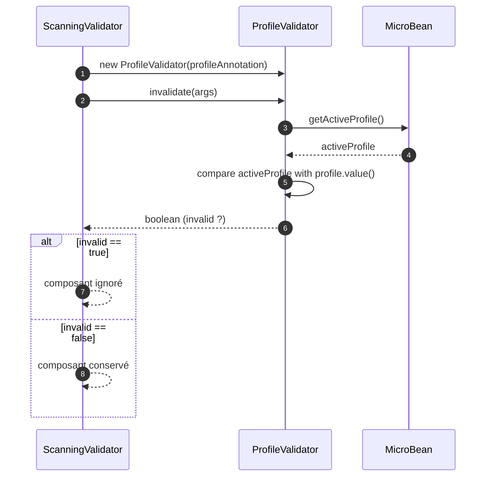
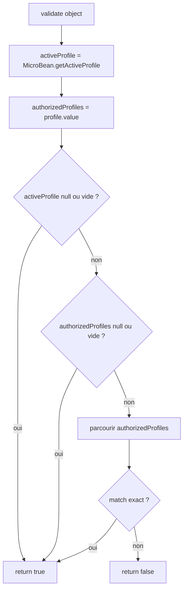

# ⚙️ ProfileValidator (infrastructure.validator)

> 📘 Documentation technique orientée maintenance et évolution.

## 1) 🧭 Vue d'ensemble

`ProfileValidator` est l'implémentation de `Validator<String[]>` chargée de décider si un composant peut être activé en fonction du profil actif de l'application.

Son rôle est de comparer :

- le profil courant exposé par `MicroBean.getActiveProfile()` (propriété système `app.profile`) ;
- la liste des profils autorisés définie par l'annotation `@Profile`.

Responsabilités principales :

- 🔎 lire le profil actif ;
- 🏷️ récupérer la liste des profils autorisés de l'annotation ;
- ✅ retourner `true` par défaut dans les cas "profil non contraignant" ;
- 🚫 retourner `false` quand le profil actif ne correspond à aucune valeur autorisée.

Fichier source : `src/main/java/com/jasonpercus/microbean/infrastructure/validator/ProfileValidator.java`

---

## 2) 🔗 Positionnement dans le flux applicatif

`ProfileValidator` est utilisé pendant le scan des composants via `ScanningValidator`.

Flux simplifié :

1. `ScanningValidator` détecte la présence de `@Profile` sur un `@Service`, `@Adapter` ou `@Configuration`.
2. Il instancie `ProfileValidator` avec l'annotation récupérée.
3. Il appelle `profileValidator.invalidate(args)`.
4. Si le résultat est `true`, le composant est ignoré ; sinon il reste éligible.

Références principales :

- `src/main/java/com/jasonpercus/microbean/infrastructure/validator/ScanningValidator.java`
- `src/main/java/com/jasonpercus/microbean/MicroBean.java`
- `src/main/java/com/jasonpercus/microbean/api/Profile.java`

### 🧵 Diagramme de séquence

---

## 3) 💡 Idée fonctionnelle : à quoi répond cette classe

`ProfileValidator` répond au besoin d'activation conditionnelle par environnement d'exécution (ex: `debug`, `test`, `prod`).

Cette classe formalise une règle simple :

- si aucune contrainte de profil n'est réellement exploitable, le composant est autorisé ;
- sinon, le composant n'est autorisé que si le profil actif fait partie de la liste attendue.

Elle constitue un filtre léger et déterministe, exécuté avant la création des beans.

---

## 4) 🧠 Comportement méthode par méthode

### `public ProfileValidator(Profile profile)`

- Stocke l'annotation `@Profile` à évaluer.
- Ne réalise aucune validation immédiate.

### `public boolean validate(String[] object)`

> Le paramètre `object` est présent pour respecter `Validator<String[]>`, mais n'est pas utilisé dans cette implémentation.

Algorithme :

1. Lit `activeProfile` via `MicroBean.getActiveProfile()`.
2. Lit `authorizedProfiles` via `profile.value()`.
3. Si `activeProfile == null` ou vide (`""`) : retourne `true`.
4. Si `authorizedProfiles == null` ou vide : retourne `true`.
5. Sinon, parcourt `authorizedProfiles` :
   - si une valeur égale `activeProfile`, retourne `true` ;
   - sinon, retourne `false` après le parcours.

### Tableau de décision

| activeProfile | authorizedProfiles            | Résultat `validate(...)` |
|---------------|-------------------------------|--------------------------|
| `null`        | n'importe                     | `true`                   |
| `""`          | n'importe                     | `true`                   |
| non vide      | `null`                        | `true`                   |
| non vide      | `[]`                          | `true`                   |
| non vide      | contient activeProfile        | `true`                   |
| non vide      | ne contient pas activeProfile | `false`                  |

### 🌊 Diagramme de flux interne

---

## 5) 📐 Contrats implicites importants (pour la maintenance)

- ✅ Le profil actif est lu uniquement depuis `MicroBean.getActiveProfile()` (donc `app.profile`).
- ✅ Une contrainte non exploitable (`activeProfile` absent/vide, liste autorisée absente/vide) est traitée comme **validation réussie**.
- ✅ La comparaison de profil est stricte (`String.equals`), sensible à la casse.
- ✅ Aucun trim/normalisation n'est appliqué aux valeurs de profil.
- ✅ `validate(String[] object)` n'utilise pas le paramètre `object`.

---

## 6) ⚠️ Risques lors des modifications

1. **Modifier la politique par défaut (`true`)** sur profils absents/vides changerait fortement le comportement de scan.
2. **Introduire une comparaison insensible à la casse** impacterait la compatibilité avec les profils existants.
3. **Changer la source du profil actif** (autre que `MicroBean.getActiveProfile()`) casserait la cohérence globale du framework.
4. **Utiliser `args` dans ce validateur** risquerait d'introduire une ambiguïté fonctionnelle avec `ConditionValidator`.

---

## 7) 🧪 Tests existants sur `ProfileValidator`

### ✅ Tests unitaires

Fichier : `src/test/java/com/jasonpercus/microbean/infrastructure/validator/ProfileValidatorTest.java`

Cas couverts :

- profil actif absent (`System.clearProperty("app.profile")`) → `true` ;
- profil actif vide (`""`) → `true` ;
- liste des profils autorisés vide (`@Profile({})`) → `true` ;
- profil actif autorisé (`release` dans `{debug, release}`) → `true` ;
- profil actif non autorisé (`prod` hors `{debug, release}`) → `false` ;
- liste des profils autorisés `null` (mock de `Profile`) → `true`.

Garanties apportées :

- comportement nominal et cas limites de `validate(...)` ;
- isolement des tests via restauration de la propriété `app.profile` après chaque test.

---

## 8) 🧰 Ce qu'un mainteneur doit retenir

- `ProfileValidator` est un filtre d'activation simple basé sur `app.profile`.
- La règle de permissivité par défaut (`true` sur profils absents/vides) est intentionnelle et structurante.
- Le validateur ne dépend pas des `args` applicatifs.
- Il est principalement utilisé via `invalidate(args)` depuis `ScanningValidator`.
- Toute évolution doit préserver la cohérence avec les tests unitaires existants.

---

## 9) 🗺️ Légende visuelle rapide

- ✅ Validation / précondition
- 🧱 Initialisation / contexte
- 🔎 Analyse / traitement
- ⚠️ Point de vigilance
- 🧪 Couverture de tests
- 🛡️ Recommandation de fiabilité
