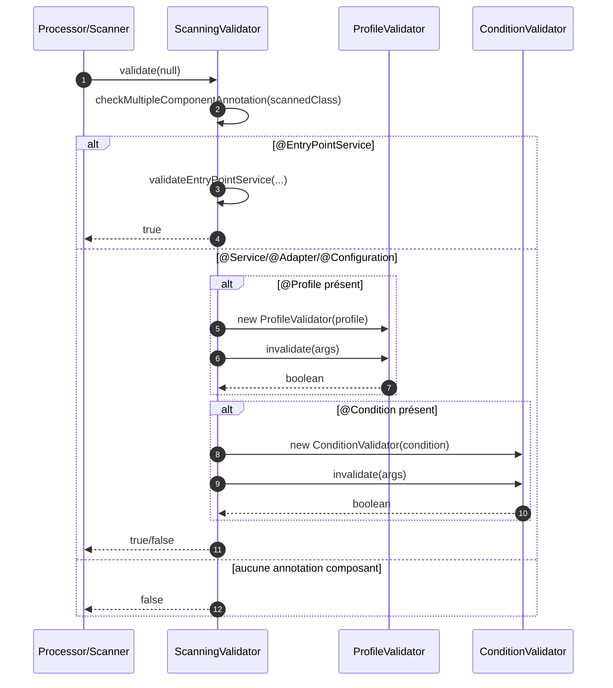
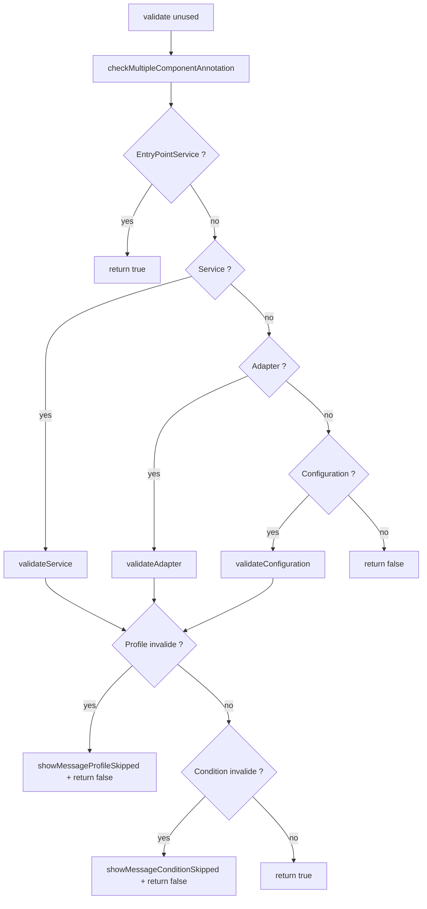

# ⚙️ ScanningValidator (infrastructure.validator)

> 📘 Documentation technique orientée maintenance et évolution.

## 1) 🧭 Vue d'ensemble

`ScanningValidator` est l'implémentation de `Validator<Void>` chargée de décider si une classe scannée doit être retenue comme composant MicroBean.

Il applique les règles d'activation par stéréotype (`@Service`, `@Adapter`, `@Configuration`, `@EntryPointService`) et les contraintes conditionnelles associées (`@Profile`, `@Condition`).

Responsabilités principales :

- 🔎 vérifier qu'une classe ne cumule pas plusieurs annotations de composant incompatibles ;
- 🧱 orienter la validation selon le type de composant détecté ;
- 🏷️ appliquer les règles de profil via `ProfileValidator` ;
- ✅ appliquer les règles conditionnelles via `ConditionValidator` ;
- 📝 journaliser les composants ignorés (profil ou condition non satisfaits).

Fichier source : `src/main/java/com/jasonpercus/microbean/infrastructure/validator/ScanningValidator.java`

---

## 2) 🔗 Positionnement dans le flux applicatif

`ScanningValidator` est utilisé dans le pipeline de scan/traitement des classes pour filtrer les candidats avant leur enregistrement et leur création.

Flux simplifié :

1. Le scanner détecte une classe annotée potentielle.
2. `ScanningValidator.validate(null)` est appelé.
3. Le validateur contrôle l'unicité des annotations de composant.
4. Il délègue au bloc de validation correspondant (`Service`, `Adapter`, `Configuration`, `EntryPointService`).
5. Les validations `@Profile` et `@Condition` peuvent exclure la classe.
6. Le résultat booléen détermine si la classe est conservée ou ignorée.

Références principales :

- `src/main/java/com/jasonpercus/microbean/infrastructure/validator/ProfileValidator.java`
- `src/main/java/com/jasonpercus/microbean/infrastructure/validator/ConditionValidator.java`
- `src/main/java/com/jasonpercus/microbean/MicroBean.java`

### 🧵 Diagramme de séquence

---

## 3) 💡 Idée fonctionnelle : à quoi répond cette classe

`ScanningValidator` répond à un besoin de **filtrage déterministe** des classes pendant la phase de scan.

Il évite :

- l'activation de composants incohérents (annotations multiples incompatibles) ;
- l'activation de composants hors profil ;
- l'activation de composants dont les conditions personnalisées échouent.

Cette classe centralise la logique de décision binaire "retenu / ignoré" avant les étapes suivantes du cycle de vie IoC.

---

## 4) 🧠 Comportement méthode par méthode

### `public boolean validate(Void unused)`

- Point d'entrée principal.
- Vérifie d'abord les annotations multiples.
- Route ensuite vers :
  - `validateEntryPointService(...)` si `@EntryPointService` ;
  - `validateService(...)` si `@Service` ;
  - `validateAdapter(...)` si `@Adapter` ;
  - `validateConfiguration(...)` si `@Configuration`.
- Retourne `false` si aucune annotation composant n'est présente.

### `private boolean validateEntryPointService(...)`

- Implémentation actuelle minimale : retourne toujours `true`.
- Pas de validation `@Profile` / `@Condition` à ce niveau.

### `private static boolean validateService(...)`

- Si `@Profile` est présent :
  - crée `ProfileValidator` ;
  - si `invalidate(args)` retourne `true`, log profile + retourne `false`.
- Si `@Condition` est présent :
  - crée `ConditionValidator` ;
  - si `invalidate(args)` retourne `true`, log condition + retourne `false`.
- Retourne `true` si aucune contrainte ne rejette le composant.

### `private static boolean validateAdapter(...)`

- Même logique que `validateService(...)`, appliquée à `@Adapter`.

### `private static boolean validateConfiguration(...)`

- Même logique que `validateService(...)`, appliquée à `@Configuration`.

### `private static void checkMultipleComponentAnnotation(...)`

- Compte la présence des annotations `@Service`, `@EntryPointService`, `@Adapter`, `@Configuration`.
- Si `count > 1`, lève `classIsAnnotatedWithMultipleComponentAnnotations(...)`.

### `private static void showMessageConditionSkipped(...)`

- Choisit le message selon `negate` :
  - `SKIPPING_COMPONENT_NEGATE_CONDITION_IS_NOT_MET` si `true` ;
  - `SKIPPING_COMPONENT_CONDITION_IS_NOT_MET` sinon.
- Émet un log debug avec type de composant + nom de classe abrégé.

### `private static void showMessageProfileSkipped(...)`

- Émet un log debug d'exclusion profil avec composant, classe et profil actif.

### Tableau de décision simplifié

| Cas                                                             | Résultat  |
|-----------------------------------------------------------------|-----------|
| Aucune annotation composant                                     | `false`   |
| Annotations composant multiples                                 | Exception |
| `@EntryPointService`                                            | `true`    |
| `@Service/@Adapter/@Configuration` sans `@Profile`/`@Condition` | `true`    |
| `@Profile` non satisfait                                        | `false`   |
| `@Condition` non satisfaite (`negate` inclus)                   | `false`   |

### 🌊 Diagramme de flux interne

---

## 5) 📐 Contrats implicites importants (pour la maintenance)

- ✅ Une classe ne doit porter qu'un seul stéréotype parmi `@Service`, `@EntryPointService`, `@Adapter`, `@Configuration`.
- ✅ L'ordre de décision dans `validate(...)` est structurant (priorité de routage par annotation).
- ✅ Pour `Service/Adapter/Configuration`, `@Profile` est évalué avant `@Condition`.
- ✅ Le rejet se fait via `invalidate(args)` des validateurs dédiés.
- ✅ Le logging d'exclusion fait partie du comportement attendu pour diagnostiquer les composants ignorés.

---

## 6) ⚠️ Risques lors des modifications

1. **Changer l'ordre de routage** dans `validate(...)` peut modifier les composants retenus.
2. **Supprimer la vérification d'annotations multiples** autoriserait des états ambigus.
3. **Inverser l'ordre Profile/Condition** changerait les logs et potentiellement les diagnostics.
4. **Modifier `validateEntryPointService`** peut impacter l'activation des entry points.
5. **Toucher à `showMessageConditionSkipped`** doit conserver le cas `negate=true` pour garder des traces correctes.

---

## 7) 🧪 Tests existants sur `ScanningValidator`

### ✅ Tests unitaires

Fichier : `src/test/java/com/jasonpercus/microbean/infrastructure/validator/ScanningValidatorTest.java`

Couverture actuelle :

- classe sans annotation composant → `false` ;
- annotations composant multiples → exception ;
- `@EntryPointService` simple → `true` ;
- cas nominaux et négatifs pour `@Service`, `@Adapter`, `@Configuration` ;
- profils correspondants et non correspondants ;
- conditions `true` / `false` ;
- conditions avec `negate=true` (évaluateur `true` et `false`) ;
- restauration de `app.profile` après chaque test.

Garanties apportées :

- décision binaire correcte pour les trois stéréotypes principaux ;
- couverture explicite des chemins `invalidate(args) == true` et `invalidate(args) == false` ;
- couverture explicite de la branche de message conditionnel pour `negate=true`.

---

## 8) 🧰 Ce qu'un mainteneur doit retenir

- `ScanningValidator` est le filtre central d'activation au moment du scan.
- Il délègue la logique métier de profil/condition à `ProfileValidator` et `ConditionValidator`.
- La règle d'unicité des annotations composant est une protection structurante.
- Le logging d'exclusion est utile au debug et doit rester cohérent avec les causes réelles.
- Toute évolution doit être rejouée contre `ScanningValidatorTest` qui couvre déjà un spectre large de cas.

---

## 9) 🗺️ Légende visuelle rapide

- ✅ Validation / précondition
- 🧱 Initialisation / contexte
- 🔎 Analyse / traitement
- ⚠️ Point de vigilance
- 🧪 Couverture de tests
- 🛡️ Recommandation de fiabilité
