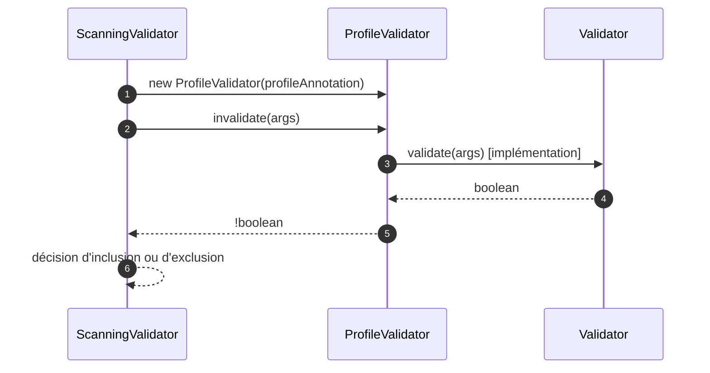
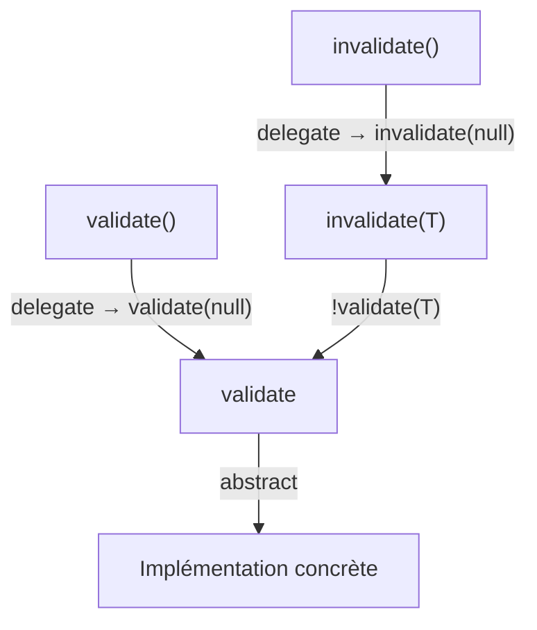

# ⚙️ Validator (infrastructure.validator)

> 📘 Documentation technique orientée maintenance et évolution.

## 1) 🧭 Vue d'ensemble

`Validator<T>` est l'**interface de contrat générique** pour la validation au sein du framework MicroBean.

Son rôle est de définir une convention uniforme pour tout validateur : une classe qui implémente `Validator<T>` reçoit l'objet principal à valider **via son constructeur**, le stocke dans un attribut d'instance, et expose des méthodes pour évaluer sa validité en passant éventuellement des données additionnelles de type `T`.

Ses responsabilités principales sont les suivantes :

- 📋 définir le contrat de validation via `validate(T parameter)` ;
- 🔄 fournir une version sans argument via `validate()` par délégation sur `validate(null)` ;
- 🔁 fournir les méthodes inverses `invalidate(T parameter)` et `invalidate()` par négation de `validate(...)` ;
- 🧱 servir de socle commun à toutes les implémentations de validation dans l'infrastructure.

Fichier source : `src/main/java/com/jasonpercus/microbean/infrastructure/validator/Validator.java`

---

## 2) 🔗 Positionnement dans le flux applicatif

`Validator<T>` est utilisé par tous les validateurs de l'infrastructure, en particulier lors du scan des composants et de l'évaluation des conditions d'activation.

Le flux général d'utilisation est le suivant :

1. Une classe annotée est découverte lors du scan.
2. Un validateur concret (`ScanningValidator`, `ProfileValidator`, `ConditionValidator`) est instancié avec l'objet à valider.
3. La méthode `validate(...)` ou `invalidate(...)` est appelée pour décider si le composant doit être retenu.
4. En cas de rejet, le composant est ignoré et un message de debug est émis.

Implémentations directes dans le projet :

- `src/main/java/com/jasonpercus/microbean/infrastructure/validator/ProfileValidator.java`
- `src/main/java/com/jasonpercus/microbean/infrastructure/validator/ConditionValidator.java`
- `src/main/java/com/jasonpercus/microbean/infrastructure/validator/ScanningValidator.java`

Interface étendue indirectement via :

- `src/main/java/com/jasonpercus/microbean/api/ConditionEvaluator.java`

### 🧵 Diagramme de séquence (utilisation typique)

---

## 3) 💡 Idée fonctionnelle : à quoi répond cette interface

`Validator<T>` répond à un besoin d'**homogénéité du contrat de validation**.

Sans cette interface, chaque validateur définirait ses propres signatures, rendant le code difficile à maintenir et impossible à substituer polymorphiquement.

Elle impose deux invariants fondamentaux :

- **`invalidate(T)`** est toujours la négation de **`validate(T)`** : toute implémentation qui surcharge `validate` bénéficie automatiquement des méthodes `invalidate` correctes.
- **`validate()`** et **`invalidate()`** délèguent systématiquement à leurs versions paramétrées avec `null` : il n'y a pas de logique dupliquée.

---

## 4) 🧠 Comportement méthode par méthode

### `boolean validate(T parameter)`

- Méthode **abstraite**, à implémenter obligatoirement.
- Évalue si l'objet d'instance (passé au constructeur) est **valide**.
- `parameter` sert uniquement à fournir des données **additionnelles** à la validation (par exemple, les `args` applicatifs) ; il ne représente pas l'objet principal à valider.
- Retourne `true` si valide, `false` sinon.

### `default boolean validate()`

- Délègue à `validate(null)`.
- Permet d'appeler la validation sans données additionnelles.
- Ne doit pas être surchargée dans les implémentations concrètes, sauf besoin exceptionnel justifié.

### `default boolean invalidate(T parameter)`

- Retourne `!validate(parameter)`.
- Permet d'écrire `if (validator.invalidate(args))` de façon lisible là où on souhaite tester l'échec de validation.
- Automatiquement cohérente avec `validate` : ne jamais surcharger sans surcharger `validate` en conséquence.

### `default boolean invalidate()`

- Délègue à `invalidate(null)`.
- Permet d'appeler la vérification d'invalidité sans données additionnelles.

### 🌊 Diagramme de flux (appels entre méthodes)

---

## 5) 📐 Contrats implicites importants (pour la maintenance)

- ✅ **L'objet principal à valider est toujours injecté par constructeur** : `Validator<T>` ne reçoit pas cet objet en paramètre de méthode.
- ✅ **`T` est un paramètre additionnel**, pas l'objet à valider : il peut être `null` (via les surcharges sans argument).
- ✅ **`invalidate(T)` doit toujours être la négation de `validate(T)`** : ne jamais fournir une logique indépendante dans `invalidate`.
- ✅ **Les surcharges par défaut ne doivent pas être surchargées inutilement** : elles garantissent la cohérence des quatre méthodes.
- ✅ **Toute implémentation doit être sûre à l'emploi avec `null` comme paramètre** : les surcharges sans argument passent `null`.

---

## 6) ⚠️ Risques lors des modifications

Si vous modifiez `Validator<T>`, vérifier en priorité :

1. **Cohérence `validate` / `invalidate`** : si la logique par défaut de `invalidate` est modifiée, toutes les implémentations concrètes peuvent voir leur comportement changer silencieusement.
2. **Appel avec `null`** : les surcharges sans argument passent `null`. Si une implémentation concrète de `validate(T)` ne gère pas `null`, elle cassera lors d'un appel sans paramètre.
3. **Substitution polymorphique** : `Validator<T>` est utilisé comme type générique dans `ConditionEvaluator` et `ProfileValidator`. Tout changement de signature impacte ces classes.

---

## 7) 🧪 Tests existants sur `Validator`

### ✅ Tests unitaires

Fichier : `src/test/java/com/jasonpercus/microbean/infrastructure/validator/ValidatorTest.java`

Les tests unitaires couvrent les points suivants.

#### Comportement de `validate(T)`

- retourne `true` quand le prédicat est satisfait ;
- retourne `false` quand le prédicat n'est pas satisfait.

#### Délégation de `validate()`

- délègue bien vers `validate(null)` ;
- le paramètre reçu dans l'implémentation est effectivement `null`.

#### Comportement de `invalidate(T)`

- retourne `false` quand `validate(T)` retourne `true` ;
- retourne `true` quand `validate(T)` retourne `false`.

#### Délégation de `invalidate()`

- délègue bien vers `invalidate(null)` ;
- le paramètre reçu dans l'implémentation est effectivement `null`.

#### Approche de test

Les tests utilisent un `SpyValidator` interne à la classe de test : une implémentation contrôlée de `Validator<String>` basée sur un `Predicate<String>` configurable, qui enregistre le dernier paramètre reçu via un `AtomicReference`.

---

## 8) 🧰 Ce qu'un mainteneur doit retenir

- `Validator<T>` est un **contrat structurant** : toute la logique de validation du framework en découle.
- Son principal invariant est que **`invalidate` est toujours la négation de `validate`** : ne jamais rompre cette symétrie.
- Le paramètre `T` est **additionnel**, pas principal : l'objet à valider vit dans l'état de l'implémentation concrète.
- Les méthodes par défaut garantissent la **cohérence des quatre variantes** avec un minimum de code dans les implémentations.
- En cas de doute, préférer utiliser `validate(T)` et `invalidate(T)` explicitement plutôt que les surcharges sans argument.

---

## 9) 🗺️ Légende visuelle rapide

- ✅ Validation / précondition
- 🧱 Initialisation / contexte
- 🔎 Analyse / traitement
- ⚠️ Point de vigilance
- 🧪 Couverture de tests
- 🛡️ Recommandation de fiabilité
